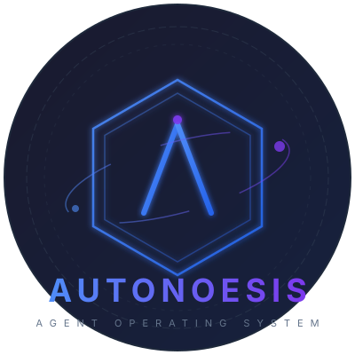

<p align="center">
  
</p>

<p align="center">
  <strong>Enterprise Governed Self-Evolving Agent Operating System — Engineering Preview</strong>
</p>

<p align="center">
  <a href="https://github.com/darifo/autonoesis/actions/workflows/ci.yml">
    
  </a>
  <a href="LICENSE">
    
  </a>
  <a href="https://www.python.org/downloads/">
    
  </a>
  <a href="https://nodejs.org/">
    
  </a>
  
</p>

---

> [!WARNING]
> Autonoesis is an architecture prototype and engineering preview. Its production
> authority, durable execution, multi-tenant isolation, evidence, and release paths
> are not yet end-to-end proven. Do not use it for production or high-risk writes.

**Autonoesis** is building an enterprise platform that takes **responsibility
for the facts of intelligent execution** — governing every action, verifying
every outcome, and safely evolving agent behavior over time.

```text
Intent → GoalContract → ContextSnapshot → Plan → Durable Run → Task
→ Governed Action → Evidence → Outcome → Evaluation
→ ImprovementProposal → Candidate → Shadow/Canary/Stable/Rollback
```

[中文说明](README.zh-CN.md) ·
[Architecture](docs/architecture/overview.md) ·
[ADR](docs/adr/README.md) ·
[Production Readiness Plan](docs/roadmap/enterprise-production-readiness-remediation.md) ·
[Capability Maturity](docs/roadmap/capability-maturity.md) ·
[Integration Guide](docs/architecture/integration-guide.md)

---

## Why Autonoesis

The table below describes the **target architecture**, not current production-proven behavior.
See the [capability maturity matrix](docs/roadmap/capability-maturity.md) for implemented evidence.

| Target Capability | What It Means |
|---|---|
| **Goal-First** | Work is a verifiable `GoalContract` — not a chat message. Success criteria, budget, and deadline are explicit. |
| **Durable Execution** | Goals survive disconnections, crashes, and restarts via Temporal durable workflows. |
| **Governed Action** | Every external side effect passes identity, policy, budget, approval, and idempotency checks at runtime. |
| **Evidence-Based Outcomes** | A tool saying "done" is not proof. Outcomes are verified by reading authoritative state from external systems. |
| **Governed Evolution** | Improvements become Candidates, pass independent evaluation gates, and promote Shadow → Canary → Stable with automatic rollback. |
| **Multi-Tenant Isolation** | Tenants are isolated across identity, data, credentials, runtime, network, budget, and release dimensions. |

### How It Compares

Autonoesis is **not** a LangChain, CrewAI, or AutoGPT alternative. Those are
rapid-prototyping frameworks where the LLM directly drives state. Autonoesis
enforces a governance layer between "the model wants to do X" and "X actually
happens." See [Platform Positioning](docs/architecture/platform-positioning.md)
for the full comparison.

---

## Quick Start

```bash
# Create and activate environment
conda env create -f environment.yml
conda activate autonoesis

# Install Python workspace
UV_PROJECT_ENVIRONMENT="$CONDA_PREFIX" uv sync --inexact --all-packages --dev

# Install TypeScript workspace
pnpm install

# Run all quality checks
ruff format --check . && ruff check . && mypy apps packages --ignore-missing-imports && pytest
```

### Local Prototype Stack (Docker Compose)

```bash
docker compose -f infra/compose/docker-compose.yml up --build
```

This stack is for local development. Its default credentials, in-memory application
assembly, unpinned MinIO image, and infrastructure configuration are not production-safe.

| Service | URL |
|---|---|
| API (Swagger) | http://localhost:8000/docs |
| Cockpit | http://localhost:4173 |
| Temporal UI | http://localhost:8088 |
| MinIO Console | http://localhost:9001 |
| Jaeger | http://localhost:16686 |

### Single-Process Development

```bash
python -m uvicorn autonoesis_api.main:app --reload   # API
pnpm --filter @autonoesis/cockpit dev                 # Cockpit
python -m autonoesis_worker.main                       # Worker
```

---

## Architecture

The target architecture organizes responsibility into **eight logical planes**
(not eight microservices). The prototype currently defines three process entry
points: **API**, **Worker**, and **Cockpit**; this is not a production deployment topology.

| Plane | Responsibility | Implementation |
|---|---|---|
| **Interaction** | Who is calling? | FastAPI, Cockpit, SDKs |
| **Intelligence** | What should we do? | Goal Clarifier, Planner, Capability Selector |
| **Runtime** | How does the plan advance? | Temporal Workflows, Harness, Checkpoint |
| **Environment** | What's the state of the world? | Fact Registry, Projection, Refresh |
| **Context** | What should this run see? | Retrieval, ACL, Freshness, Compression, Snapshot |
| **Integration** | How to safely connect tools? | Model Gateway, Tool Gateway, MCP/A2A |
| **Data & Evidence** | How to persist and prove? | PostgreSQL, MinIO, Audit, Telemetry |
| **Governance** | On what authority? | Identity, Policy, Budget, Approval, Kill Switch |

**Read more**: [Architecture Overview](docs/architecture/overview.md) ·
[Integration Guide](docs/architecture/integration-guide.md) ·
[Application Scenarios](docs/architecture/application-scenarios.md)

---

## Project Structure

```
autonoesis/
├── apps/
│   ├── api/              # FastAPI control plane (HTTP/SSE)
│   ├── worker/           # Temporal Worker (workflows + activities)
│   ├── cockpit/          # React operations console
│   └── gateway/          # Reserved: independent Tool/Model data plane
├── packages/
│   ├── domain/           # Pure domain objects, state machines, invariants
│   ├── contracts/        # Cross-process schemas & envelopes
│   ├── application/      # Command/Query handlers, transaction boundaries
│   ├── runtime-kernel/   # Harness SPI, Gateway protocols, Kill Switch
│   ├── capability/       # Capability Pack manifest & validation
│   ├── intelligence/     # Goal clarification, planning, decisions
│   ├── context/          # Retrieval, ACL, freshness, compression
│   ├── environment/      # Facts, projections, refresh, simulation
│   ├── memory/           # Memory SPI, ledger, write gate, deletion
│   ├── gateways/         # Model/Tool/MCP/A2A boundaries
│   ├── governance/       # Identity, policy, budget, kill switch
│   ├── evaluation/       # Cases, suites, trials, graders
│   ├── improvement/      # Analysis, proposals, releases
│   ├── evolution/        # Replay, Shadow/Canary, FinOps, SLO
│   ├── adapters/         # Provider/Protocol/Persistence adapters
│   ├── testkit/          # Fakes, attack suites, contract tests
│   ├── py-sdk/           # Python client SDK
│   └── ts-sdk/           # TypeScript client SDK
├── docs/                 # Architecture, ADR, Contracts, Runbooks
├── infra/                # Compose, Migrations, Policies, Helm, Terraform
├── examples/             # Reference Capability Packs
└── tools/                # Codegen, dev CLI, release tooling
```

**Dependency rule**: `apps → application → domain`. Domain depends on nothing.
Adapters implement ports defined by domain/application/runtime-kernel.

---

## Delivery Status

Legacy MVP phases recorded implementation breadth, not production readiness. Their
current evidence has been recalibrated below; P0 remediation remains in progress.

| Legacy Phase | Current Maturity | Production Readiness Gap |
|---|---|---|
| **Phase 0** | `integrated` / partly `unit-tested` | P0-02 contracts are frozen; P0-04 Application use cases have PostgreSQL component evidence, while real Tool/Evidence end-to-end execution remains incomplete. |
| **Phase 1** | PostgreSQL and Temporal `integrated`; otherwise partial `unit-tested` | Production assembly uses PostgreSQL authority and recoverable Temporal dispatch; API consumer contracts and full multi-process E2E remain. |
| **Phase 2** | Tool Gateway `integrated`; otherwise partial `unit-tested` | PostgreSQL, Temporal and OPA are CI gates; MinIO evidence and a real third-party effect are not. |
| **Phase 3** | `unit-tested` | Deployment/Release persistence exists; real Shadow traffic, Canary routing, and Release Executor remain. |
| **Phase 4** | `specified` | Production operations and hardening are planned only. |

Current production limitations and reproducible baseline evidence are recorded in
the [production readiness baseline](docs/roadmap/production-readiness-baseline.md).

---

## Contributing

See [CONTRIBUTING.md](CONTRIBUTING.md) for development process and definition
of done. See [AGENTS.md](AGENTS.md) for architecture rules and immutable
constraints — domain purity, dependency direction, and greenfield boundaries.

## License

Released under the [MIT License](LICENSE).
