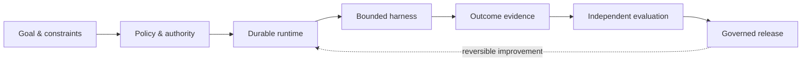

<div align="center">
  

  # Autonoesis

  **Enterprise Governed Self-Evolving Agent Operating System**

  企业级受治理自进化智能体操作系统

  **English** · [简体中文](README.zh-CN.md)

  [](https://github.com/darifo/autonoesis/actions/workflows/ci.yml)
  [](https://www.python.org/)
  [](LICENSE)
  [](docs/roadmap/mvp.md)
</div>

Autonoesis is a greenfield platform for enterprise agents that operate across time, learn from real outcomes, and evolve through governed, auditable, and reversible releases.

It is not one oversized agent. Goals, durable execution, authority, context, memory, tools, evidence, evaluation, and release governance remain explicit system boundaries—so every consequential action has an owner, a policy decision, and verifiable outcome evidence.

## Why Autonoesis

| Boundary | What it protects |
| --- | --- |
| **Goal ≠ prompt** | Goals retain scope, constraints, success criteria, and risk limits beyond a single model turn. |
| **Runtime ≠ harness** | The runtime controls ordering, isolation, recovery, and resources; harnesses execute bounded tasks. |
| **Tool ≠ authority** | Every external side effect is re-authorized at execution time. |
| **Output ≠ outcome** | Completion depends on evidence from the real system, not model confidence. |
| **Improvement ≠ release** | Candidates pass independent evaluation, approval, shadow/canary, and rollback gates. |

## System shape



PostgreSQL is the authority for accepted business state. Temporal is the authority for durable workflow history. Models may propose commands; only governed application paths may mutate authoritative state.

## Current status

> **Phase 0 — architecture baseline and contracts**

The initial implementation establishes dependency direction, stable vocabulary, a health endpoint, a worker entry point, and contract/domain/runtime seams. Provider integrations and infrastructure are intentionally deferred until their boundaries are proven by vertical slices.

## Repository map

```text
autonoesis/
├── apps/                 # API, Worker, Cockpit, and reserved Gateway boundary
├── packages/             # domain, contracts, application, runtime, and adapters
├── infra/                # delivery, policy, observability, and migrations
├── examples/             # reference agents and evaluation suites
├── docs/                 # architecture, ADRs, contracts, threats, and runbooks
└── tools/                # development, code generation, and release tooling
```

The initial deployment has three processes: API, Worker, and Cockpit. Gateway logic begins in shared packages and becomes an independent process only when security, scale, or reuse justifies that operational boundary.

## Quick start

### Prerequisites

- [Conda](https://docs.conda.io/)—installs Python and `uv` from `environment.yml`
- Node.js 22+ and pnpm—for the Cockpit workspace
- [Task](https://taskfile.dev/)—the repository-level command interface
- Docker or another OCI-compatible runtime—for future infrastructure work

### Bootstrap and verify

```bash
conda env create --file environment.yml
conda activate autonoesis
task bootstrap
task check
```

### Run locally

```bash
# API with reload
task api

# Worker bootstrap/configuration check
task worker
```

The API health endpoint is available at `http://127.0.0.1:8000/health/live`.

<details>
<summary><strong>Commands without Task</strong></summary>

```bash
conda env create --file environment.yml
conda activate autonoesis
UV_PROJECT_ENVIRONMENT="$CONDA_PREFIX" uv sync --inexact --all-packages --dev

ruff format --check .
ruff check .
mypy apps packages
pytest
```

</details>

## Documentation

| Topic | Guide |
| --- | --- |
| Architecture | [Overview](docs/architecture/overview.md) · [Repository boundaries](docs/architecture/repository-layout.md) |
| Decisions | [Architecture decision records](docs/adr/README.md) |
| Engineering | [Local development](docs/runbooks/local-development.md) · [Contributing](CONTRIBUTING.md) |
| Interfaces | [Contract rules](docs/contracts/README.md) |
| Delivery | [MVP roadmap](docs/roadmap/mvp.md) |
| Security | [Threat model](docs/threat-models/README.md) · [Security policy](SECURITY.md) |

## Contributing

Autonoesis is architecture-first. Prefer small, reviewable changes that preserve authority and dependency boundaries. Read [AGENTS.md](AGENTS.md) and the relevant ADRs before implementation, then run `task check` before opening a pull request.

## License

Released under the [MIT License](LICENSE).
