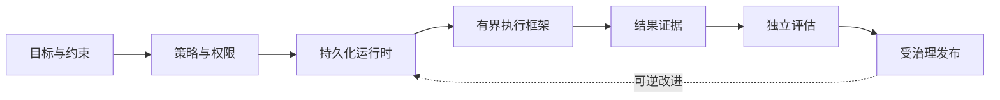

<div align="center">
  

  # Autonoesis

  **企业级受治理自进化智能体操作系统**

  Enterprise Governed Self-Evolving Agent Operating System

  [English](README.md) · **简体中文**

  [](https://github.com/darifo/autonoesis/actions/workflows/ci.yml)
  [](https://www.python.org/)
  [](LICENSE)
  [](docs/roadmap/mvp.md)
</div>

Autonoesis 是一个面向企业智能体的全新平台。它让智能体能够跨越时间持续运行、从真实结果中学习，并通过受治理、可审计、可逆的发布流程实现演进。

它并不是一个不断膨胀的“超级智能体”。目标、持久化执行、权限、上下文、记忆、工具、证据、评估与发布治理都是明确的系统边界——确保每一项关键操作都有责任主体、策略决策和可验证的结果证据。

## 为什么选择 Autonoesis

| 系统边界 | 保护的内容 |
| --- | --- |
| **目标 ≠ 提示词** | 目标在单次模型调用之外持续保留范围、约束、成功标准与风险限制。 |
| **运行时 ≠ 执行框架** | 运行时控制顺序、隔离、恢复与资源；执行框架只负责完成边界明确的任务。 |
| **工具 ≠ 权限** | 每一项外部副作用都必须在执行时重新完成授权检查。 |
| **输出 ≠ 结果** | 是否完成取决于真实系统提供的证据，而不是模型自身的置信度。 |
| **改进 ≠ 发布** | 候选改进必须通过独立评估、审批、影子/金丝雀验证与回滚门禁。 |

## 系统形态



PostgreSQL 是已接受业务状态的权威数据源，Temporal 是持久化工作流历史的权威数据源。模型可以提出命令，但只有受治理的应用路径能够修改权威状态。

## 当前状态

> **Phase 0 — 架构基线与契约**

当前实现建立了依赖方向、稳定术语、健康检查端点、Worker 入口，以及契约、领域和运行时之间的边界。提供商集成与基础设施将保持延后，直到端到端垂直切片证明其边界合理。

## 仓库结构

```text
autonoesis/
├── apps/                 # API、Worker、Cockpit 与预留的 Gateway 边界
├── packages/             # 领域、契约、应用、运行时与适配器
├── infra/                # 交付、策略、可观测性与数据库迁移
├── examples/             # 参考智能体与评估套件
├── docs/                 # 架构、ADR、契约、威胁模型与运行手册
└── tools/                # 开发、代码生成与发布工具
```

初始部署由 API、Worker 和 Cockpit 三个进程组成。Gateway 逻辑首先存在于共享包中，只有当安全性、规模或复用需求足以抵消运维成本时，才拆分为独立进程。

## 快速开始

### 前置条件

- [Conda](https://docs.conda.io/)——通过 `environment.yml` 安装 Python 和 `uv`
- Node.js 22+ 与 pnpm——用于 Cockpit 工作区
- [Task](https://taskfile.dev/)——仓库级命令入口
- Docker 或其他兼容 OCI 的运行时——用于后续基础设施开发

### 初始化并验证

```bash
conda env create --file environment.yml
conda activate autonoesis
task bootstrap
task check
```

### 本地运行

```bash
# 启动支持热重载的 API
task api

# 检查 Worker 初始化与配置
task worker
```

API 健康检查地址为 `http://127.0.0.1:8000/health/live`。

<details>
<summary><strong>不使用 Task 时的命令</strong></summary>

```bash
conda env create --file environment.yml
conda activate autonoesis
UV_PROJECT_ENVIRONMENT="$CONDA_PREFIX" uv sync --inexact --all-packages --dev

ruff format --check .
ruff check .
mypy apps packages
pytest
```

</details>

## 文档

| 主题 | 指南 |
| --- | --- |
| 架构 | [架构概览](docs/architecture/overview.md) · [仓库边界](docs/architecture/repository-layout.md) |
| 决策 | [架构决策记录](docs/adr/README.md) |
| 工程实践 | [本地开发](docs/runbooks/local-development.md) · [贡献指南](CONTRIBUTING.md) |
| 接口 | [契约规则](docs/contracts/README.md) |
| 交付 | [MVP 路线图](docs/roadmap/mvp.md) |
| 安全 | [威胁模型](docs/threat-models/README.md) · [安全策略](SECURITY.md) |

## 参与贡献

Autonoesis 坚持架构优先。请优先提交范围小、易审查并且能够维护权限与依赖边界的改动。开始实现前请阅读 [AGENTS.md](AGENTS.md) 和相关 ADR，并在发起 Pull Request 前运行 `task check`。

## 许可证

本项目采用 [MIT 许可证](LICENSE) 发布。
