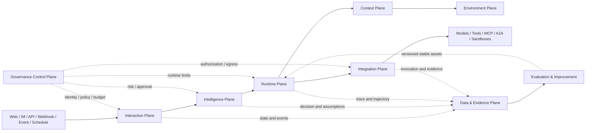
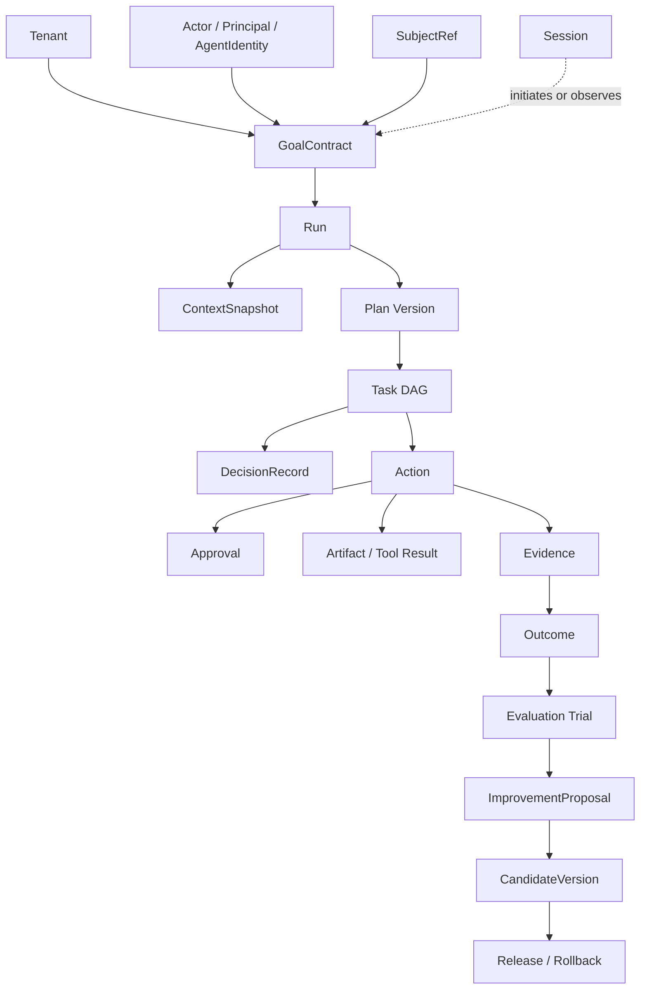
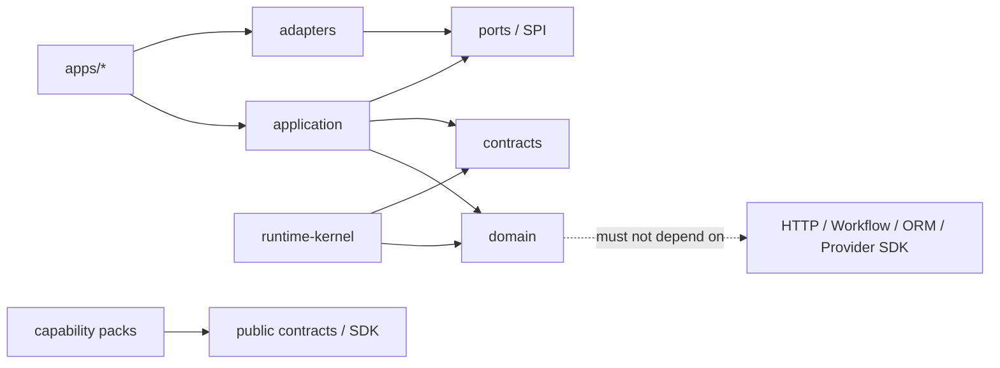
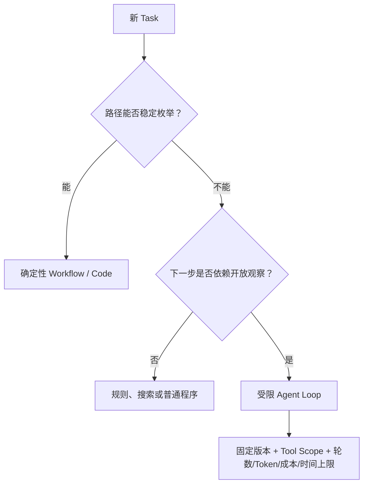
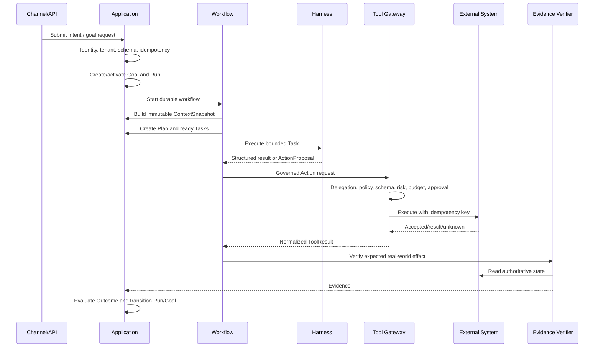
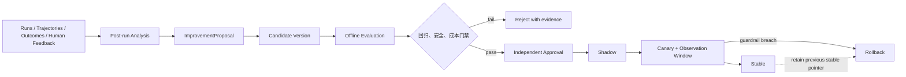
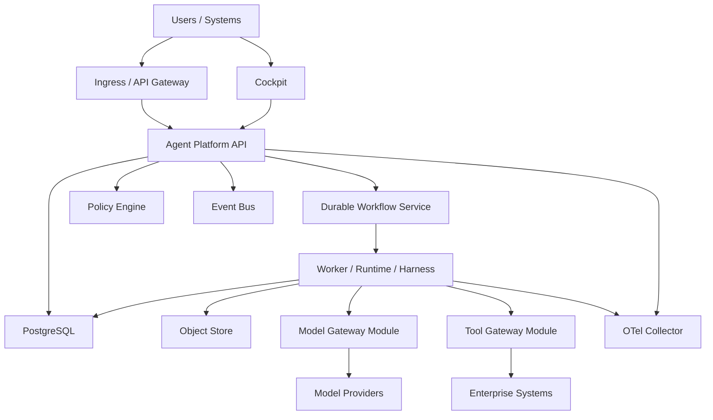

# 企业级 Agentic OS / Agent Platform 底座架构设计

> 文档性质：架构基线与工程实施规范  
> 适用对象：架构师、平台开发、Agent 开发、安全治理、SRE、评估与产品团队  
> 基线版本：1.0  
> 更新日期：2026-08-09  
> 架构定位：Enterprise Governed Self-Evolving Agent Operating System

---

## 0. 文档目的与使用方式

本文档将历史讨论中的 Goal-first、八个逻辑平面、Runtime/Harness 分离、可持久运行、统一 Model/Tool Gateway、Evidence-first、Evaluation-first、受控自进化与企业治理收敛为一份规范性总设计。

它同时服务于两类工作：

1. 指导代码框架开发：确定领域对象、模块边界、依赖方向、权威写入者、运行流程和验收标准；
2. 指导文档体系建设：规定哪些内容应进入总架构、ADR、契约、威胁模型、Runbook、SLO 和 Capability Pack 文档。

本文档使用以下规范词：

- **MUST / 必须**：安全、一致性或平台语义不可破坏的要求；
- **SHOULD / 应当**：默认实现，偏离时需要记录理由；
- **MAY / 可以**：可按业务、规模或合规需求选配。

---

## 1. 执行摘要

企业级 Agentic OS 不是一个堆叠了 Prompt、工具和长期记忆的“大 Agent”，而是一套对智能运行事实负责的企业平台：

- 以 **Goal Contract** 表达目标、约束、成功标准、风险、预算和时间边界；
- 以 **Durable Workflow** 推进跨时间、可暂停、可恢复、可取消的 Run；
- 以 **Governed Action** 管理每一个真实副作用；
- 以 **Evidence + Outcome** 证明现实世界的结果，而非相信模型的完成声明；
- 以 **Evaluation + Governed Release** 实现可审查、可回归、可回滚的能力进化；
- 以 **Identity, Delegation, Policy, Budget, Audit** 确保 Agent 不会因为“能调用”就变成“有权执行”。

总体闭环为：

```text
Intent
  → GoalContract
  → ContextSnapshot
  → Plan / Decision
  → Durable Run
  → Task
  → Governed Action
  → Evidence
  → Outcome
  → Evaluation
  → ImprovementProposal
  → Candidate
  → Shadow / Canary / Stable / Rollback
```

首期物理部署建议保持简单：`API + Worker + Cockpit`，Model/Tool Gateway 先作为独立模块边界，当安全域、吞吐、凭证或团队边界足够明确时再拆成独立进程。逻辑平面不等于微服务数量。

---

## 2. 系统定位与责任边界

### 2.1 平台负责什么

平台应对以下“智能运行事实”负责：

- Goal、Session、Run、Plan、Task、Decision、Action；
- Context Snapshot、Trajectory、Artifact、Evidence、Outcome；
- Agent、Skill、Tool、Model Route 与 Capability Pack 的版本；
- Identity Context、Delegation、Policy Decision、Approval、Budget、Audit；
- Evaluation Case、Suite、Trial、Grader Result；
- Improvement Proposal、Candidate、Release、Rollback。

### 2.2 平台不负责什么

平台不应成为 CRM、ERP、ITSM、EMR、制造 MES 或项目系统的替代品。客户、订单、合同、病例、设备、工单等业务实体的权威状态必须留在原业务系统。

底座使用：

```text
SubjectRef(system, subject_type, subject_id, version)
```

引用外部业务对象。`Case` 可作为业务应用或 Capability Pack 中的持续事项聚合，但不作为通用底座的强制领域模型。

### 2.3 核心承诺

| 承诺 | 工程含义 |
| --- | --- |
| Durable Agency | 任务不依赖一次 HTTP、对话或 Worker 进程存活 |
| Explicit Authority | 身份、委托、权限、预算、审批和凭证均为显式对象 |
| Evidence-Based Outcome | Tool 成功不等于业务 Outcome 已实现 |
| Governed Evolution | 改进先成为 Candidate，通过独立评估和发布门禁后才可 Stable |
| Replaceable Intelligence | 模型、Harness、Memory Provider、MCP/A2A 实现均可替换 |
| Enterprise Isolation | 租户、身份、数据、凭证、运行、网络、预算和发布维度均可隔离 |

---

## 3. 架构原则与不可破坏的不变量

### 3.1 总体原则

1. **Goal 不是 Prompt**：Goal 必须包含成功标准、证据要求、约束、Owner、风险、预算和期限。
2. **确定性编排优先**：可枚举的路径使用 Workflow；只在下一步取决于开放观察时使用受限 Agent Loop。
3. **模型只能提议**：模型输出必须变成可校验的 Command/Proposal，不得直接修改权威状态。
4. **最小副作用边界**：每个外部写入都必须是一个可独立授权、审批、去重和验证的 Action。
5. **单一权威写入者**：每类核心对象必须有唯一语义上的写入者，不依靠最终一致性掩盖多主冲突。
6. **现实验证优先**：Tool Result 只是回执；Outcome 必须由权威系统回读、签名事件或其他 Evidence 证明。
7. **最小必要上下文**：每一阶段只获取必要且有权查看的信息，不把所有聊天和检索结果塞进模型。
8. **评估与改进分离**：一个组件不得同时生成、评分并发布自己的 Candidate。
9. **历史不覆盖**：Run、Plan Version、Decision、Action、Evidence、Evaluation 和 Release 记录必须可追溯。
10. **默认可恢复和可回滚**：设计重试、补偿、检查点、暂停、接管和版本回滚，不依赖“从头再来”。

### 3.2 必须通过自动化测试的不变量

- 任何跨租户 ID 访问均被拒绝，且不泄露对象是否存在；
- Session 关闭不得隐式终止已启动的 Run；
- 非法状态跳转必须失败；
- 重复消息、重复回调和 Workflow Replay 不得产生重复副作用；
- 审批必须绑定精确 Action 参数摘要，参数变化后必须重新审批；
- Action 超时后不得自动假定失败并重试写入；
- Verified Outcome 必须引用 Evidence；
- Candidate 的 generator、grader 与 approver 必须满足职责分离；
- 身份、授权、租户隔离、审计保留和 Kill Switch 不得被自进化链路直接修改；
- 任何 Stable 能力必须可定位到确切的版本、评估和审批证据。

---

## 4. 总体架构

### 4.1 八个逻辑平面



| 平面 | 回答的核心问题 | 主要模块 |
| --- | --- | --- |
| Interaction | 请求从哪里来，是谁，如何归一化 | Channel Adapter、Identity Verify、Session Router、API/SSE |
| Intelligence | 目标是什么，应如何计划和决策 | Goal Manager、Planner、Decision、Capability Selector |
| Runtime | 计划如何跨时间可靠推进 | Orchestrator、Workflow、Harness、Checkpoint、Workspace |
| Environment | 此刻外部世界的可验证状态是什么 | Fact Registry、Projection、Freshness、Simulation |
| Context | 这次运行应该看到什么 | Retrieval、ACL Filter、Rank、Conflict、Compression、Snapshot |
| Integration | 如何安全连接模型、工具和其他 Agent | Model Gateway、Tool Gateway、MCP Host、A2A Gateway |
| Data & Evidence | 如何保存状态、历史、证据和可观测数据 | PostgreSQL、Object Store、Event Bus、Audit、Telemetry |
| Governance | Agent 凭什么行动，谁能审批和接管 | Identity、Delegation、Policy、Approval、Budget、Kill Switch |

> 平面是逻辑责任边界，不是强制的物理部署单元。

### 4.2 三条不能混淆的流

| 流 | 主链路 | 不可跨越的边界 |
| --- | --- | --- |
| 控制流 | Request → Goal → Plan → Decision → Run Command → State Transition | 模型输出不能直接转成权威状态 |
| 执行流 | Task → Harness → Model/Skill → Tool Proposal → Action → Result | 工具调用必须经过执行时治理 |
| 证据流 | Snapshot/Decision/Invocation/Artifact/Fact → Evidence → Outcome → Evaluation | 生成者不能独立证明自己成功 |

### 4.3 控制面、数据面与执行面

- **控制面**：能力注册、策略、预算、身份、发布、租户配置和运营控制台；
- **数据面**：在线模型/工具调用、Context 装配、事件交付和 Evidence 捕获；
- **执行面**：Workflow、Activity、Sandbox、Workspace 和有边界的 Agent Loop。

高风险企业环境应将 Gateway 数据面部署到受控出站网络中，并与公网入口及控制台隔离。

---

## 5. 核心领域模型

### 5.1 对象关系



### 5.2 核心对象定义

| 对象 | 语义 | 最小必要字段 |
| --- | --- | --- |
| SubjectRef | 外部权威业务对象的稳定引用 | system、type、id、version |
| GoalContract | 一个可管理、可验证的目标合同 | goal_type、statement、desired_outcome、subjects、criteria、constraints、owner、risk、budget、deadline |
| Session | 交互连续性，不是执行生命周期 | actor、channel、goal_refs、status |
| Run | 一次独立核算、恢复和审计的执行 | goal_id、agent_version、status、budget_snapshot、timestamps |
| Plan | 版本化 Task DAG 及其前提 | run_id、version、tasks、assumptions、created_by |
| Task | 无外部副作用语义的可调度工作单元 | dependencies、completion_criterion、assigned_capability、status |
| DecisionRecord | 为什么执行、拒绝、升级或重规划 | decision、rationale、facts、policy_version、actor/principal/agent |
| Action | 最小可治理副作用边界 | tool、operation、resource、parameters、risk、idempotency_key、expected_effect |
| Artifact | 执行生成的内容或文件 | digest、media_type、storage_ref、classification、provenance |
| Evidence | 对真实世界状态的可引用观测 | source、reference、observed_state、captured_at、integrity |
| Outcome | 成功标准是否在现实中成立 | criterion、status、evidence_refs |
| Evaluation Trial | 固定版本、环境和预算下的一次评估 | subject_version、case、harness、transcript、outcome、grader_results |
| CandidateVersion | 未经生产发布门禁的能力新版本 | baseline、artifact、generator、suite、status |

### 5.3 权威写入者矩阵

| 对象 | 权威写入者 | 不是权威来源的组件 |
| --- | --- | --- |
| Goal / Run / Action / Approval / Outcome | Application Use Case（权威存储：Core PostgreSQL） | 模型、Temporal Search Attribute、Trace |
| Workflow 历史、Timer、Signal、Retry | Durable Workflow Engine | 数据库投影、队列消息 |
| 外部业务实体 | 对应 CRM/ERP/ITSM/业务系统 | Agent DB、向量库、Memory |
| Evidence Payload | 不可变对象存储 | 临时 Workspace、模型摘要 |
| Knowledge | 企业指定的知识源 | 检索排名、LLM 重写 |
| Memory | 通过 Memory Write Gate 接受的 Memory Ledger | 一次运行输出、派生表征 |
| Policy / Delegation | IAM / Policy Administration Point | Agent Prompt、Tool Description |
| Stable Capability | Release Service | Improvement Generator、单一 Grader |

### 5.4 状态机基线

```text
Goal:
  Draft  → Active | Cancelled
  Active → Paused | Satisfied | Failed | Cancelled
  Paused → Active | Failed | Cancelled

Run:
  Pending          → Running | Cancelled
  Running          → Blocked | AwaitingEvidence | Succeeded | Failed | Cancelled
  Blocked          → Running | Failed | Cancelled
  AwaitingEvidence → Succeeded | Failed | Cancelled

Task:
  Pending → Ready | Blocked
  Ready   → Running | Blocked
  Running → Blocked | Succeeded | Failed
  Blocked → Ready | Failed

Action:
  Proposed         → AwaitingApproval | Authorized | Denied
  AwaitingApproval → Authorized | Denied
  Authorized       → Executing
  Executing        → Succeeded | Failed | Unknown
  Unknown          → Succeeded | Failed

Candidate:
  Draft            → Evaluating | Rejected
  Evaluating       → AwaitingApproval | Rejected
  AwaitingApproval → Approved | Rejected
  Approved         → Stable
  Stable           → RolledBack
```

所有状态跳转必须在领域层显式定义，由 Application Use Case 完成事务性持久化和事件发布。不允许 Controller、ORM Hook、Workflow 脚本或模型自由写状态。

`EvaluationCase` 是一个可复现的评估样本，与可选的业务 `Case` 聚合无关，代码命名和文档中不得混用两者。

### 5.5 Goal 澄清、规划与决策逻辑

对稀疏输入的处理不能只输出一个笼统“置信度”。平台应将不确定性拆为：意图、范围、事实、因果、能力、结果可验证性和风险不确定性。

澄清决策应按如下规则进行：

```text
解析 Intent
  → 区分已知事实、假设、偏好和约束
  → 评估缺失信息对成功和风险的敏感度
  → 低风险且可逆：显式记录假设后继续
  → 影响范围、权限、金额、不可逆结果：向人澄清
  → 无法验证成功标准：不启动自动执行
  → 形成版本化 GoalContract
```

Planner 的输出必须是 Task DAG，并声明依赖、前提、能力、完成标准、预计成本、风险、补偿可能性和 Evidence 需求。规划过程可生成多个 Plan Candidate，但选择结果必须通过硬约束校验和可审计的 DecisionRecord。

对复杂冲突，建议使用可观测的辩证式决策模板，不保存隐藏思维链：

```text
建立关系与约束图
  → 记录当前状态和历史条件
  → 提出多个可验证因果假设
  → 标记主要/次要冲突与影响方
  → 评估现实前提和可实现性
  → 使用工具、仿真或小规模实验验证
  → 区分稳定规律与偶然波动
  → 达到阈值后切换策略
  → 保留旧方案有效部分，生成新 Plan Version
  → 记录剩余冲突和未验证假设
```

必须触发 Replan 的事件包括：关键 Environment Fact 过期或变更、前置 Task 失败、预算/期限越界、策略变更、审批改变可执行范围、新 Evidence 否定关键假设、外部对象版本冲突，以及测量到预定义的质量/风险阈值。

---

## 6. 核心模块与代码边界

### 6.1 推荐的 Monorepo 结构

```text
agent-platform/
├── apps/
│   ├── api/                    # HTTP/SSE/Webhook，只做协议入口与进程装配
│   ├── worker/                 # Durable Workflow/Activity/Harness Worker
│   ├── cockpit/                # 运营、审批、证据、评估和发布控制台
│   └── gateway/                # 达到拆分条件后的独立 Model/Tool 数据面
├── packages/
│   ├── domain/                 # 纯领域对象、状态机和不变量
│   ├── contracts/              # 跨进程/跨语言 Schema、Envelope、错误目录
│   ├── application/            # Command/Query Handler、UoW、事务边界
│   ├── capability/             # Capability Pack Manifest、发现、安装和验证
│   ├── intelligence/           # Goal 澄清、Planning、Decision、能力选择
│   ├── runtime-kernel/         # Orchestrator、Harness SPI、Workspace、Checkpoint
│   ├── context/                # 检索、ACL、时效、冲突、压缩、Snapshot
│   ├── environment/            # Environment Fact、投影、刷新、仿真
│   ├── memory/                 # Memory SPI、Ledger、Write Gate、删除传播
│   ├── gateways/               # Model、Tool、MCP、A2A、Channel 统一边界
│   ├── governance/             # Identity、Delegation、Policy、Approval、Budget、Audit
│   ├── evaluation/             # EvaluationCase、Suite、Trial、Harness、Grader
│   ├── improvement/            # Analysis、Proposal、Candidate、Release、Rollback
│   ├── adapters/               # Provider / Protocol / Persistence 适配器
│   └── testkit/                # Fake Provider、攻击套件、契约测试支撑
├── sdk/                             # Python / TypeScript / Java / Go 客户端
├── examples/                        # 仅依赖公开接口的参考 Capability Pack
├── infra/                           # Compose、Helm、IaC、Policy、OTel、Supply Chain
├── docs/                            # Architecture、ADR、Contracts、Threat Models、Runbooks
└── tools/                           # Codegen、Schema Check、Release、Dev CLI
```

### 6.2 依赖方向



必须遵守：

- `domain` 不依赖 FastAPI/Spring、Temporal、ORM、数据库、队列和 Provider SDK；
- `contracts` 只表达稳定数据契约，不复制领域行为；
- `application` 拥有用例编排、事务边界、Outbox 写入和乐观锁；
- `apps/*` 只拥有协议入口、配置、依赖注入和进程生命周期；
- `adapters` 实现端口，外部 Provider 对象不得泄漏到 Domain/Application API；
- `examples` 不得被 Core 反向依赖；
- 跨边界依赖变更必须有 ADR 和架构依赖测试。

### 6.3 服务拆分条件

一个模块只有同时具备以下多项条件时才应拆成独立服务：

- 有独立团队和生命周期；
- 已有稳定的远程契约；
- 需要独立安全域、凭证域或数据区域；
- 扩缩容曲线与主应用显著不同；
- 故障隔离或多平台复用收益大于网络跳转和运维复杂度。

---

## 7. Runtime、Orchestrator 与 Harness

### 7.1 责任分离

| 组件 | 负责 | 不负责 |
| --- | --- | --- |
| Orchestrator | Task 依赖、状态推进、Timer、Signal、并行、重试和恢复 | 自由推理、直接调用高风险 Tool |
| Runtime | 运行隔离、资源、Workspace、Sandbox、Lease、Heartbeat、Cancellation | 业务目标定义 |
| Harness | 组装 Agent Version、Context Snapshot、Model、Skill、Tool Scope、Loop 与遥测 | 全局 Run 状态、企业授权、Stable 发布 |
| Agent Loop | 在一个 Task 内基于观察选择下一步 | 无上限自治、无证据宣告 Goal 完成 |

### 7.2 选择 Workflow 还是 Agent Loop



每个 Agent Loop 必须固定：

- Agent/Prompt/Skill/Tool/Model Route 版本；
- Context Snapshot ID 及允许刷新的 Fact 类型；
- 可见 Tool 集合与可操作资源范围；
- 最大 turn、token、成本、时间、并发和子 Agent 深度；
- 成功、失败、阻塞、升级、应急终止条件；
- 必须保存的可观测 Transcript 与不得保存的隐藏思维内容。

### 7.3 正常执行流程



### 7.4 失败分类与处置

| 失败类型 | 默认处置 |
| --- | --- |
| 瞬时性无副作用失败 | 有上限指数退避重试 |
| 结构化输出无效 | 同一轮修复一次，仍失败则 Blocked/Replan |
| 上下文缺失或过期 | 刷新指定 Fact 或人工澄清，生成新 Snapshot |
| 策略拒绝 | 不重试，记录 Decision，可按策略升级 |
| 预算耗尽 | 暂停并请求新预算或改走降级路由 |
| 副作用执行前失败 | 在幂等保证内重试 |
| 副作用结果未知 | Action 进入 Unknown，先对账/回读，禁止盲目重试 |
| 已发生部分副作用 | 按预定义补偿计划或人工接管 |
| 环境与计划前提冲突 | 保留旧 Plan，生成新 Plan Version 并重规划 |

---

## 8. Context、Environment、Knowledge、Memory 与 State

### 8.1 五类信息必须分开

| 类型 | 回答 | 权威性 | 时间特征 | 写入规则 |
| --- | --- | --- | --- | --- |
| State | 平台对象当前处于什么状态 | 强 | 当前 | 仅经领域用例和状态机 |
| Environment Fact | 外部世界此刻是什么样 | 按来源 | 短时、需刷新 | 从权威连接器观测，带 valid_until |
| Knowledge | 组织认可的稳定事实与规则 | 中至强 | 版本化 | 由知识源与内容治理发布 |
| Memory | 从历史经验中值得跨运行复用的信息 | 建议性 | 有 TTL、冲突与失效 | 通过独立 Memory Write Gate |
| Context | 本阶段为完成目标允许看到的最小可信视野 | 派生 | 一次运行快照 | 按策略装配并冻结 |

向量索引只是检索投影，不能成为任何一类信息的权威库。

### 8.2 Context Assembly Pipeline

```text
Purpose & Task
  → Identity / Tenant / Delegation Scope
  → Candidate Source Discovery
  → Row/Document/Object ACL Filter
  → Freshness & Validity Check
  → Provenance & Trust Scoring
  → Conflict Detection
  → Relevance / Utility / Cost Ranking
  → Data Minimization & Redaction
  → Compression with source links
  → Token Budget Allocation
  → Immutable ContextSnapshot
```

Snapshot 应冻结：身份与委托引用、Goal/Plan 版本、知识版本、Memory ID、Tool/Skill/Model 版本、历史摘要的 digest、冲突和未决假设。

长任务中不应冻结过期的环境事实。涉及价格、库存、权限、对象版本、服务健康或人员状态的行动，执行前必须刷新。

### 8.3 Memory Write Gate

任何运行内观察都不得直接进入 Stable Memory。写入管线为：

```text
Observation / Feedback / Trajectory
  → MemoryCandidate
  → Provenance and consent check
  → PII / secret / classification scan
  → Scope and tenant check
  → Confidence and recurrence check
  → Conflict and staleness check
  → Human or policy approval
  → MemoryRecord with TTL
  → Index projection
```

必须支持更正、失效、删除传播、溯源和源数据权利请求。用户偏好、组织策略和身份权限不应混合存在一个无类型的 `memory` 字段中。

---

## 9. Model Gateway、Tool Gateway 与外部协议

### 9.1 Model Gateway

Model Gateway 应提供：

- 统一请求/响应契约和 Provider Adapter；
- 基于能力、数据分类、地域、风险、上下文长度的硬过滤；
- 基于质量、延迟、成本、配额和历史成功率的路由；
- 显式、有序和可审计的 fallback；
- Token/成本预算、速率限制、熔断、超时和重试分类；
- 结构化输出 Schema 验证、使用量记录和版本指纹；
- Prompt/response 的数据最小化、脱敏、保留和区域策略。

路由算法必须先执行硬约束，再优化软目标，不得为了便宜或延迟越过数据和安全限制。

### 9.2 Tool Gateway 执行管线

```text
Resolve Identity
  → Verify Delegation
  → Policy Decision
  → Tool/Operation/Resource Scope Check
  → Schema & Semantic Validation
  → Risk Classification
  → Budget / Quota / Rate Check
  → Exact-Parameter Approval
  → Credential Brokering
  → Idempotency Reservation
  → Execute in Egress/Sandbox Boundary
  → Normalize Result
  → Verify Effect
  → Record Evidence and Audit
```

Tool Invocation Envelope 至少包含：

```yaml
invocation_id: uuid
tenant_id: uuid
run_id: uuid
task_id: uuid
action_id: uuid
actor_id: uuid
principal_id: uuid
agent_identity: string
delegation_ref: string
tool: string
tool_version: string
operation: string
resource_scope: string
arguments: object
argument_digest: sha256
risk_level: l0_compute | l1_read | l2_reversible_write | l3_high_impact_write | l4_privileged
idempotency_key: string
budget_ref: string
approval_ref: string | null
policy_version: string
expected_effect: string
deadline: rfc3339
traceparent: string
data_classification: public | internal | confidential | restricted
```

Tool Result 必须使用统一语义：`accepted | succeeded | failed | denied | unknown`，并分开 `retryable`、`side_effect_possible`、`external_reference`、`verification_required` 与 `evidence_refs`。

### 9.3 MCP、A2A 与普通 API 的边界

| 机制 | 使用场景 | 平台规则 |
| --- | --- | --- |
| 普通 API/SDK | 确定系统间的业务调用 | 优先使用简单稳定契约 |
| MCP | Agent 应用发现和调用 Tool/Resource/Prompt/Skill | MCP 能力发现不等于授权，仍经 Tool Gateway |
| A2A | 跨独立 Agent 系统的发现、长任务、Artifact 和状态协作 | 通过 A2A Gateway 建立信任、委托、数据和预算边界 |
| Handoff | 同一 Runtime 内的控制权转移 | 不默认创建新 Run，不表示新的企业委托 |
| Event/Webhook | 外部状态变化唤醒 Workflow | 需验签、Inbox 去重、因果关联和 Schema 验证 |

协议只解决连接和互操作，不自动建立信任、授权、数据使用权或成功证明。

---

## 10. Agent、Skill、Tool 与 Capability Pack 规范

### 10.1 Agent Definition

Agent 必须是不可变的版本化定义，至少声明：

- 身份与职责；
- 可接受的 Goal/Task 类型；
- Instruction/Prompt Asset 版本；
- Skill 依赖及版本范围；
- Tool 能力上限，不是实际授权；
- Context Policy 和 Memory Policy；
- Model Route 策略；
- Runtime Profile、Sandbox Profile 和资源上限；
- Evaluation Suite、风险等级和发布通道；
- 供应链来源、签名和内容 digest。

### 10.2 Skill Package

Skill 是程序性知识，不是长期记忆的同义词。一个 Skill Package 应包含：

- Manifest：ID、版本、输入/输出 Schema、所需 Tool、风险和预算；
- Instructions：稳定步骤、停止条件、负向路径和验证方法；
- Scripts：可测试的确定性操作；
- References：按需加载的知识；
- Assets/Templates：可复用资产；
- Tests/Evals：核心、边界、失败和攻击用例；
- Provenance：作者、来源、许可、SBOM 和签名。

技能应渐进式披露，不将全部参考资料常驻 Context。

### 10.3 Capability Pack

Capability Pack 是行业和场景扩展的标准交付单元，可声明：

- Goal Type 及其 JSON Schema；
- Agent/Skill/Tool/Workflow 引用；
- SubjectRef 规则和 Connector；
- Context/Memory Policy；
- 默认预算、风险和审批要求；
- Evaluation Suite 和 Outcome Evidence 要求；
- 数据分类、保留和区域限制；
- 依赖、签名、安全扫描和兼容范围。

安装管线必须执行 Manifest 严格校验、Schema 校验、版本匹配、引用完整性、依赖审查、签名/SBOM 验证、租户授权和审计记录。

---

## 11. Multi-Agent 设计

### 11.1 何时使用 Multi-Agent

只有当以下至少一项收益可被测量时才应引入：

- 可并行的独立子问题显著缩短端到端时间；
- 不同专业、数据或工具权限必须隔离；
- 需要生成者与独立审查者分离；
- 不同模型或视角能有效降低系统性盲区；
- 外部 Agent 本身是独立受治理系统。

不应为了角色扮演、群聊展示或“更像组织”而拆分 Agent。

### 11.2 编排规则

- 并行任务必须使用显式 fan-out/fan-in DAG；
- 每个子 Agent 使用独立 Context、Workspace、Tool Scope、Budget 和运行 ID；
- 子 Agent 返回结构化 Result/Artifact/Evidence，不共享无边界的对话历史；
- 聚合者必须检查来源、冲突、缺失与不确定性；
- 委派不能放大权限，子 Agent 有效权限必须是父权限与任务授权的交集；
- 必须限制深度、fan-out、总成本、总时间和重试；
- 独立 Grader 不应看到不必要的生成者身份或推理暗示。

---

## 12. 身份、委托、授权与人机协同

### 12.1 身份模型

| 概念 | 含义 |
| --- | --- |
| Actor | 发起、审批、接管或取消行为的真实人或系统主体 |
| Principal | 执行时安全上的身份主体 |
| Agent Identity | 被版本化和管理的 Agent 执行身份 |
| Delegation | Actor/Principal 在时间、目标、资源、动作和预算范围内的授权证明 |
| Credential | 调用外部系统所需的短期机密，不进入 Prompt 或持久上下文 |

有效权限应按交集计算：

```text
EffectiveAuthority =
  TenantPolicy
  ∩ PrincipalPermission
  ∩ DelegationScope
  ∩ AgentCapabilityCeiling
  ∩ GoalConstraints
  ∩ RuntimePolicy
  ∩ ActionSpecificApproval
```

### 12.2 风险分级

| 级别 | 例子 | 默认控制 |
| --- | --- | --- |
| L0 Compute | 本地推理、纯计算、无出站生成 | Sandbox、资源上限 |
| L1 Read | 读取文档、查询业务数据 | ACL、数据最小化、审计 |
| L2 Reversible Write | 创建草稿、可回滚配置 | 显式策略、幂等、验证、补偿 |
| L3 High-impact Write | 发款、发布、删除、对外发送 | 精确参数审批、双人原则可选、强证据 |
| L4 Privileged | IAM、安全策略、生产基础设施 | 默认禁止 Agent 自主执行，需专用受控流程 |

### 12.3 人类接管点

平台必须支持：

- 输入澄清：意图、范围、成功标准或业务 Owner 不明；
- 行动审批：高影响、不可逆、对外声明、金额或权限变更；
- 冲突裁决：多个权威源冲突、策略无法决定；
- 异常接管：Action Unknown、补偿失败、重复超限或环境高度不确定；
- 结果认定：成功标准需专业判断，无法自动验证；
- 发布与回滚：Candidate 晋升、风险接受和生产回滚。

审批请求必须向审批人展示差异、影响、精确参数、证据、可逆性、费用和过期时间，不能只显示“是否允许 Agent 继续”。

### 12.4 策略执行与预算治理

策略系统应区分：

- **PAP**：策略编写、评审、测试、签名和发布；
- **PDP**：基于身份、委托、资源、风险、环境和策略版本作出 allow/deny/obligation 决策；
- **PEP**：在 API、Context Retrieval、Runtime、Tool Gateway、Release 等执行点强制决策；
- **PIP**：为决策提供当前组织、资源、风险、时间和数据分类信息。

策略决策必须记录策略版本、输入摘要、结果、obligation 和拒绝原因；某个上游检查通过不能代替 Action 执行前的重新检查。

预算应形成 `Tenant → Capability → Goal → Run → Task/Action` 的层级边界，并统一管理：

- 模型 token/费用、Tool 次数/费用、Sandbox CPU/GPU/时间、存储和网络；
- 并发数、Agent Loop turn、子 Agent 深度/fan-out、重试次数和总时间；
- 执行前预留、执行后结算、失败释放、Unknown Action 保留与对账；
- soft limit 告警/降级与 hard limit 暂停/拒绝；
- 超额审批和预算调整必须生成新的可审计版本，不得修改历史 Run 快照。

---

## 13. 数据、事件、证据与可观测性

### 13.1 存储分工

| 介质 | 保存内容 | 不保存内容 |
| --- | --- | --- |
| PostgreSQL | 核心对象、版本、索引、审批、预算、Outbox/Inbox、Audit 元数据 | 大体积 Artifact 原文 |
| Durable Workflow Store | Workflow 事件、Timer、Signal、Retry、Replay 历史 | 业务权威状态 |
| Object Store | 不可变 Artifact/Evidence payload、报告和较大 Transcript | 可直接查询的状态机 |
| Event Bus | 事件交付和订阅 | 长期权威状态 |
| Search/Vector | 可重建的检索投影 | 权威 Knowledge/Memory/State |
| Telemetry Backend | Metric、Log、Trace 与分析投影 | Goal/Outcome 最终业务判定 |

### 13.2 事件一致性

- 领域状态与 Outbox Event 必须在同一数据库事务中提交；
- Publisher 至少一次投递，Consumer 通过 Inbox 和稳定幂等键去重；
- 事件使用 CloudEvents 风格 Envelope，携带 tenant、correlation、causation、trace、schema_version 和 classification；
- 历史事件的语义不得原地更改；
- 外部回调必须验签，并验证它与 Action/Run 的因果关系。

### 13.3 Trace、Trajectory、Audit 与 Evidence

| 记录 | 回答的问题 |
| --- | --- |
| Log | 某个组件当时输出了什么 |
| Trace | 请求如何穿过分布式组件，耗时在哪里 |
| Trajectory | Agent 看到什么、做了什么可观测决策、受到什么反馈 |
| Audit | 谁代表谁，在什么策略和版本下，为什么获准或被拒绝 |
| Evidence | 外部世界中哪个可验证状态能证明 Outcome |

审计应使用追加式记录，并最小化保存 Prompt、PII、Secret 和原始业务数据。需要强合规时可将审计 digest 导出到 WORM 存储。

### 13.4 可观测性与 AI FinOps

必须建立以 Goal/Run 为顶层维度的遥测关联，而不只是以模型调用为中心。

关键指标包括：

- 结果：Goal satisfaction rate、Outcome verified rate、Evidence completeness；
- 可靠性：Run success/block/cancel rate、Action unknown rate、recovery time；
- 质量：Evaluation pass rate、regression rate、human correction rate；
- 安全：policy deny、approval bypass attempt、prompt injection、cross-tenant violation；
- 成本：cost per verified Goal、token/tool/sandbox cost、wasted retry cost；
- 效率：time-to-first-plan、time-to-outcome、approval wait、critical path duration；
- 进化：Candidate win rate、canary rollback rate、time-to-stable、capability drift。

优化目标应是“每个已验证成功 Goal 的总成本”，而不是单个 Token 价格或单次模型延迟。

---

## 14. Evaluation-first 与受控进化

### 14.1 评估对象

```text
EvaluationCase     一个可复现场景、输入、约束和成功证据
EvaluationSuite    有明确覆盖结构、权重和版本的 Case 集合
EvaluationHarness  固定模型、Tool Stub/Simulation、环境、预算和采集方式
EvaluationTrial    对某个待评版本的一次独立运行
GraderResult       某个规则、模型或人类评分者的结果与证据
```

Grader 顺序应为：

1. 确定性规则：Schema、状态、文件、数据、安全不变量；
2. Outcome/Evidence 验证：真实或仿真环境是否达标；
3. Trajectory 检查：是否有越权、偶然命中、过度重试、不必要暴露；
4. LLM Grader：处理语义质量，必须使用 rubric 和校准集；
5. Human Grader：专业、高风险、价值或边界样本。

评估结果应允许 `pass | fail | unknown | invalid`，不得迫使不可判定样本进入绿色指标。

### 14.2 快循环与慢循环

- **快循环**：当前 Run 内的重试、澄清、重规划、反思和人工接管；不修改 Stable 能力。
- **慢循环**：跨 Run 的对比、归因、经验提炼、Candidate 生成、离线评估、Shadow/Canary 与发布。

### 14.3 受控改进管线



### 14.4 可进化与禁止自发布的对象

| 对象 | 可生成 Candidate | 可否无人生产发布 |
| --- | --- | --- |
| Prompt / Agent Instruction | 是 | 仅低风险且满足预批准策略时 |
| Skill / Workflow Asset | 是 | 默认否，需测试、签名和审批 |
| Tool Description / Context Policy | 是 | 否，需安全回归 |
| Model Route / Budget Heuristic | 是 | 可在严格 guardrail 内 Canary |
| Memory Candidate / Summary Strategy | 是 | 仅能经 Memory Gate |
| 身份、委托、租户隔离 | 否 | 禁止 |
| 策略根、审计保留、Kill Switch | 否 | 禁止 |
| 生产代码、基础设施、密钥 | 可提交普通变更建议 | 禁止绕过既有 SDLC/IaC 发布流程 |

---

## 15. 治理、安全与合规

### 15.1 纵深防御层次

1. 入口：OIDC/mTLS、租户上下文、Schema、频率、内容大小；
2. 数据：分类、最小化、行/列/对象 ACL、区域、加密、保留；
3. Context：来源标签、指令/数据分离、注入检测、冲突提示；
4. Runtime：Sandbox、只读文件系统、资源限额、无特权运行、网络出站控制；
5. Tool：身份、委托、策略、风险、审批、幂等、凭证 Broker；
6. Outcome：权威回读、Evidence 完整性、不可变保存；
7. Evolution：数据分割、独立 Grader、发布审批、Shadow/Canary、回滚；
8. Supply Chain：签名、SBOM、来源证明、漏洞扫描、允许列表、制品不可变。

### 15.2 Agentic Threat Model 基线

| 威胁 | 核心控制 |
| --- | --- |
| Prompt Injection / Indirect Injection | 外部内容按不可信数据处理；模型不拥有权限；Action 执行时重新授权 |
| Tool Confusion / Excessive Agency | 能力上限与实际权限分离；最小 Tool Scope；风险分级 |
| Cross-tenant Leakage | 请求上下文、Repository 过滤、DB RLS、对象存储路径和向量索引多层隔离 |
| Credential Exfiltration | 短期凭证 Broker、禁止凭证进入 Prompt/Log/Artifact、出站允许列表 |
| Duplicate Side Effect | 稳定幂等键、执行记录、外部幂等支持和对账 |
| Approval Substitution | 审批绑定 Action digest、策略版本和过期时间；执行时复核 |
| Memory Poisoning | 候选区、来源、冲突、TTL、独立审核和删除传播 |
| Evaluation Gaming | 隐藏测试、数据分割、Outcome 优先、独立 Grader、盲评和防污染 |
| Candidate Supply-chain Attack | 签名、SBOM、可复现构建、隔离评估、显式发布门禁 |
| Audit Tampering | 追加式记录、digest 链、WORM 导出、职责分离 |
| Denial of Wallet / Resource Exhaustion | 多级预算、配额、并发、最大深度、熔断和 Kill Switch |

### 15.3 多维隔离

多租户不只是数据表增加 `tenant_id`。必须评估：

- 身份和委托隔离；
- 核心数据、Object Store、Search/Vector、Cache 隔离；
- Model/Tool 凭证与出站网络隔离；
- Workflow Namespace、Queue、Worker Pool、Sandbox 和 Workspace 隔离；
- 预算、配额、速率限制和爆炸半径隔离；
- 日志、Trace、Evaluation Dataset、Memory 和审计导出隔离；
- Capability Stable Channel 与发布策略隔离。

---

## 16. 可靠性、SLO 与灾备

### 16.1 建议的 SLI/SLO 框架

| 类别 | SLI 示例 | 建议目标方向 |
| --- | --- | --- |
| 控制面可用性 | Goal/Run/Approval API 成功率 | 按业务等级定义，不与模型 Provider 可用性绑死 |
| 持久性 | Workflow 恢复率、事件丢失率 | 可回放，核心事件零丢失 |
| 副作用安全 | 重复副作用率、Unknown Action 对账时间 | 重复副作用趋近于零，Unknown 有明确响应目标 |
| 结果完整性 | Verified Outcome 的 Evidence 完整率 | 100% |
| 治理 | 未授权 Action 执行数、跨租户泄漏数 | 0 |
| 人机协同 | 审批等待时间、接管恢复时间 | 分风险和业务时间定义 |
| 发布 | Canary 超出 guardrail 的自动回滚时间 | 可测量并经演练 |

数值型 SLO 应在容量和业务基线可观测后由产品/SRE/业务联合定义，不应在没有测量数据时伪造精确百分比。

### 16.2 恢复与灾备

- PostgreSQL 必须具备 PITR、备份校验、定期恢复演练和租户层数据恢复方案；
- Workflow Engine 必须验证 Worker 丢失、重部署、Replay 和跨区域恢复；
- Object Store 需版本化、对象锁可选、完整性 digest 和生命周期策略；
- Event Bus 不是权威源，必须可通过 Outbox 重建待发布事件；
- 凭证、密钥、策略和 Stable Pointer 需要独立备份与紧急轮换流程；
- Runbook 必须覆盖 Provider 故障、Tool 大规模 Unknown、审批积压、Memory 污染、租户泄漏怀疑、Candidate 回滚和 Kill Switch。

---

## 17. 部署架构与技术基线

### 17.1 首期部署



首期建议：

- API：Python/FastAPI 或 Java/Kotlin/Spring，但领域层不得依赖 Web 框架；
- Durable Workflow：Temporal 类引擎；
- Core DB：PostgreSQL，使用事务、乐观锁、RLS、Outbox/Inbox；
- Object Store：S3 兼容存储；
- Policy：OPA 类策略引擎，与应用内置强不变量共存；
- Event Bus：NATS JetStream/Kafka 类持久事件总线，在存在实际订阅者时引入；
- Telemetry：OpenTelemetry 作为供应商中立的采集标准；
- Cockpit：TypeScript/React，覆盖 Goal、Run、Approval、Evidence、Policy、Budget、Evaluation、Release 和 Audit。

### 17.2 生产化演进

生产阶段可按需引入：

- Kubernetes 与不同风险的 Runtime Pool；
- 独立 Gateway 出站安全域、mTLS/SPIFFE 和短期凭证 Broker；
- 按租户/区域的 Workflow Namespace、Queue、Object Store 和密钥；
- WORM Audit、SIEM 导出、DLP 和数据删除编排；
- Shadow/Canary 运行环境、评估专用 Worker Pool；
- 高基数分析存储，但不替代 Core DB。

---

## 18. 契约、版本与协议规范

### 18.1 通用 Message Envelope

每个跨进程 Command/Event 必须携带：

```yaml
message_id: uuid
correlation_id: uuid
causation_id: uuid | null
tenant_id: uuid
actor_id: uuid
principal_id: uuid | null
schema: string
schema_version: integer
created_at: rfc3339
occurred_at: rfc3339 | null  # Event 事实时间；Command 可为 null
traceparent: string | null
classification: public | internal | confidential | restricted
retention_policy: string
idempotency_key: string | null
payload: object
```

### 18.2 HTTP 规范

- 租户和身份必须来自经验证的请求上下文，不接受 Body 中的自由声明；
- 可产生副作用的写请求必须携带 `Idempotency-Key`；
- 更新必须使用乐观锁版本或 `If-Match`；
- 异步操作返回可追踪的 Goal/Run/Action 资源，不伪装成同步完成；
- 错误 Envelope 必须包含 `code`、`message`、`retryable`、`next_action`、`correlation_id`；
- 客户端可提交 Goal、审批和治理 Command，不得绕过平台直接把 Action 标记为已执行。

### 18.3 Schema 兼容性

- 新增可选字段通常可向后兼容；
- 删除、重命名、改变字段含义、新增必填字段必须升级主版本；
- 事件已发布后不得原地改变语义；
- Provider 的协议版本必须由 Adapter 屏蔽，不向核心领域泄漏；
- OpenAPI/AsyncAPI/JSON Schema/SDK 由单一契约源生成，生成物放在明确的 `generated/` 目录；
- 消费者契约测试和多版本回放测试必须进入 CI。

### 18.4 事件命名

建议使用反向域名 + 资源 + 过去时 + 版本：

```text
ai.example.agent.goal.activated.v1
ai.example.agent.run.started.v1
ai.example.agent.action.unknown.v1
ai.example.agent.outcome.verified.v1
ai.example.agent.candidate.promoted.v1
```

Command 和 Event 必须分开：Command 表达可能被拒绝的意图，Event 表达已发生且不可撤销的事实。

---

## 19. 开发规范、测试金字塔与完成定义

### 19.1 开发规范

- 领域行为优先使用纯函数、不可变值对象和显式状态转移；
- 模糊判断可交给模型，去重、阈值、权限、依赖、计分和状态推进必须用可测试代码；
- 规划和决策输出必须是结构化对象，Markdown 只是显示投影；
- 所有外部调用必须由 Port/Adapter 隔离，并有 Fake 或 Simulation 实现；
- 任何进程边界、权威源、协议、持久化、安全边界或发布策略的改变必须增加/更新 ADR；
- 不得将生产 Prompt、客户原始输入、Secret 或未脱敏 Trace 提交到代码库。

### 19.2 测试层次

| 层次 | 必测内容 |
| --- | --- |
| Domain Unit | 不变量、非法输入、状态转移、风险和摘要计算 |
| Application | 事务边界、乐观冲突、Outbox、幂等、拒绝路径 |
| Contract | Schema 兼容、Provider Adapter、Consumer Contract、错误语义 |
| Workflow Replay | 确定性、Timer/Signal、Worker 重启、取消、超时、恢复 |
| Integration | DB RLS、OIDC、OPA、Object Store、Event Bus、Model/Tool Adapter |
| Security | Prompt Injection、SSRF、凭证泄漏、跨租户、审批篡改、资源耗尽 |
| Evaluation | 成功、回归、边界、攻击、不可判定、成本和长期记忆增长 |
| End-to-End | 从 Goal 到 Evidence/Outcome，以及从 Candidate 到 Rollback 的完整链路 |
| Resilience | Provider 故障、数据库故障、重复消息、Action Unknown、灾备恢复 |

### 19.3 单个变更的 Definition of Done

- 代码格式、Lint、类型检查、单测和契约测试通过；
- 新增的状态转移、幂等、授权、恢复和负向路径有测试；
- 涉及边界变化时 ADR、架构图、契约或威胁模型已更新；
- 有可重复的验收证据，不以开发者“本地看起来没问题”为完成；
- 新增遥测不泄露敏感数据，且可关联 Goal/Run/Action；
- 数据迁移有兼容期、回滚或 forward-fix 计划；
- 运维影响已进入 Runbook/SLO/监控和告警。

---

## 20. 文档体系与写作规范

### 20.1 必备文档集

```text
docs/
├── architecture/
│   ├── overview.md
│   ├── domain-model.md
│   ├── runtime-and-flows.md
│   ├── repository-layout.md
│   └── deployment.md
├── adr/
│   ├── README.md
│   └── NNNN-<decision>.md
├── contracts/
│   ├── http-api.md
│   ├── events.md
│   ├── tool-invocation.md
│   └── capability-pack.md
├── threat-models/
│   ├── platform.md
│   ├── tool-gateway.md
│   ├── context-memory.md
│   └── evolution-supply-chain.md
├── runbooks/
│   ├── local-development.md
│   ├── action-unknown.md
│   ├── kill-switch.md
│   ├── backup-restore.md
│   └── rollback-candidate.md
├── slo/
│   ├── service-levels.md
│   └── error-budget-policy.md
├── evaluations/
│   ├── methodology.md
│   ├── suites.md
│   └── release-gates.md
└── roadmap/
    └── mvp.md
```

### 20.2 文档责任边界

| 文档 | 记录什么 | 不应记录什么 |
| --- | --- | --- |
| Architecture | 稳定目标、模块、流、权威源和不变量 | 短期任务进度 |
| ADR | 某次重要选择的背景、决策、备选和后果 | 系统所有细节的重复说明 |
| Contract | 机器可验证的跨边界 Schema、错误和兼容规则 | 领域内部实现 |
| Threat Model | 资产、信任边界、攻击路径、控制和剩余风险 | 笼统的“已加密已鉴权” |
| Runbook | 检测、诊断、缓解、恢复、验证和升级步骤 | 系统总体原理 |
| Evaluation | 数据集、评分、不确定性、统计方法和发布门禁 | 只展示最佳样例 |

### 20.3 文档写作原则

- 每篇文档标明 Owner、Status、Last Reviewed 和 Applicable Version；
- 先写系统责任和不变量，再写产品或云厂商名称；
- 图与文必须指明逻辑边界还是物理部署；
- 每个流程必须同时包含正常路径、拒绝路径、超时路径和恢复路径；
- 数据对象必须说明 Owner、Authoritative Store、Retention、Classification 和 Deletion；
- 不复制可生成的 API/Schema，文档链接契约源与生成物；
- 对未实现能力明确标记 `proposed`、`planned` 或 `implemented`；
- 每项安全声明应有可执行测试、配置或运行证据对应。

---

## 21. 分阶段实施路线

### Phase 0：架构与契约基线

交付：

- 领域语言、核心对象、状态机和 Single Writer Matrix；
- Monorepo 骨架、依赖边界测试和 ADR 模板；
- Message Envelope、HTTP 错误、Tool Invocation 和 Capability Pack Schema；
- 平台威胁模型、数据分类和最小安全基线；
- Fake Model、Fake Tool、In-memory Repository 和确定性测试套件。

退出标准：可在无外部 Provider 时演示 Goal 到 Outcome 的纯离线语义闭环。

### Phase 1：最小可靠执行闭环

交付：

- API、PostgreSQL、Durable Workflow Worker 和 Cockpit；
- Goal/Run/Plan/Task/Action/Evidence/Outcome 核心链路；
- OIDC 开发/企业模式、租户隔离、基础 Policy 和 Approval；
- 一个 Model Adapter、一个受治理 Tool Adapter 与权威回读；
- 一个行业无关参考 Capability Pack 和一套 Evaluation Suite。

退出标准：Session 断开、Worker 重启、审批等待和重复请求不破坏运行；未验证 Outcome 不得成功。

### Phase 2：生产治理与可观测

交付：

- 统一 Model/Tool Gateway、凭证 Broker、Egress Policy、预算与 AI FinOps；
- Outbox/Inbox、Object Store Evidence、Action Unknown 对账与补偿；
- OpenTelemetry、SLO、告警、审计导出、备份恢复和 Kill Switch；
- 多租户压测、攻击套件、容量基线和故障演练；
- MCP Tool Adapter，但仍通过 Tool Gateway 执行时授权。

退出标准：完成从攻击检测、策略拒绝、人工接管到恢复的生产验收。

### Phase 3：上下文、记忆与 Multi-Agent

交付：

- 完整 Context Assembly、Snapshot、Fact Refresh 和冲突处理；
- Memory Candidate/Ledger/Write Gate、TTL、失效和删除传播；
- 可复现 Simulation/Replay Environment；
- 有界子 Agent 和 fan-out/fan-in，以及必要时的 A2A Gateway；
- 长任务 Context 压缩、快照和恢复测试。

退出标准：在历史规模持续增长时，记忆准确率、上下文成本和隔离不显著退化。

### Phase 4：受控自进化

交付：

- Post-run Analysis、归因与 Improvement Proposal；
- Candidate 生成、离线 Trial、回归/安全/成本门禁；
- 职责分离、发布审批、Shadow、Canary、观察窗口与自动回滚；
- Stable Pointer、版本证据和生产漂移监测；
- 改进数据污染、评估游戏化与供应链攻击测试。

退出标准：任何上线改进均能回答“为什么改、用什么证据验证、谁批准、影响了谁、如何回滚”。

---

## 22. 端到端必须验收的场景

1. **正常执行**：稀疏输入被澄清为 Goal，执行 Action，回读 Evidence，验证 Outcome。
2. **会话断开**：用户关闭会话，Run 继续；新 Session 可查看并接管。
3. **Worker 崩溃**：运行从 Durable History 恢复，不重复已完成副作用。
4. **审批篡改**：审批后修改 Action 参数，执行被拒绝并要求重新审批。
5. **Tool 超时**：Action 进入 Unknown，对账后转为 Succeeded/Failed，无重复扣款或发布。
6. **Prompt Injection**：检索内容诱导扩权或泄露凭证，Tool Gateway 仍按有效权限拒绝。
7. **跨租户访问**：API、DB、Object Store、Search、Workflow 和遥测层均不泄露数据。
8. **计划失效**：环境 Fact 变化触发 Replan，旧 Plan 保留供审计。
9. **部分完成**：一部分 Action 成功，后续失败，执行补偿或进入人工接管。
10. **证据不足**：Tool 返回成功但无法验证现实结果，Run 停在 AwaitingEvidence/Blocked。
11. **评估不可判定**：环境异常或 Evidence 缺失，Trial 记为 Invalid/Unknown，不污染胜率。
12. **Candidate 回归**：新版本在安全或高风险样本退化，禁止晋升。
13. **Canary 回滚**：生产 guardrail 越界，自动切回上一 Stable，保留完整 Release Evidence。
14. **应急 Kill Switch**：禁用某 Tenant/Agent/Tool/Operation/Provider，正在运行的工作流进入可解释的安全状态。
15. **删除传播**：数据删除请求传播到 Memory、Search、Artifact、分析投影与下游输出，保留最小合规审计证明。

---

## 23. 反模式与明确不做的事情

- 不用一个通用向量库同时表示 State、Knowledge、Memory、Context 和 Audit；
- 不让聊天会话状态代替 Goal/Run 状态机；
- 不让一个巨型 Prompt 承担业务规则、授权、记忆和发布策略；
- 不将“工具返回 200”作为 Goal 成功的证明；
- 不对外部写入使用无幂等、无状态核对的自动重试；
- 不用消息队列代替 Durable Workflow 的长任务语义；
- 不因为概念图有八个 Plane 就创建八个微服务；
- 不用多 Agent 代替明确的代码、DAG 和独立审查管线；
- 不把 MCP Tool 可见性或 A2A Agent Card 当作企业授权；
- 不让模型根据任务需要自行获取更高权限；
- 不把一次成功轨迹直接写成 Stable Skill 或 Memory；
- 不让 Candidate 生成者自己评分、审批并发布；
- 不保存或暴露模型的隐藏思维链；保存可观测决策、输入来源、工具调用和结果证据；
- 不在没有评估集、回滚路径和运行证据前宣称系统“自进化”。

---

## 24. 建议的首批 ADR

1. 采用 Goal-first 与 `SubjectRef`，不在核心建立通用 Case 行业元模型；
2. 采用单仓多应用、模块化单体起步；
3. PostgreSQL 为接受的智能运行业务状态权威源；
4. Durable Workflow Engine 为长任务运行历史权威源；
5. 确定性 Workflow 优先，Agent Loop 仅限于有边界 Task；
6. 所有外部副作用必须经统一 Tool Gateway；
7. 采用 Outbox/Inbox 保障事件交付，不追求不存在的端到端 exactly-once；
8. State、Environment、Knowledge、Memory 和 Context 分离；
9. 采用 Evaluation-first，改进与评分/发布职责分离；
10. Capability Pack 作为行业能力的标准扩展和供应链单元；
11. 采用多维租户隔离和执行时授权；
12. 采用 Candidate → Evaluation → Approval → Shadow → Canary → Stable 的发布流程。

---

## 25. 架构评审检查表

### 语义与边界

- [ ] 外部业务对象与平台运行对象是否分开？
- [ ] 每类核心状态是否有唯一权威写入者？
- [ ] Goal、Run、Task、Action、Artifact、Evidence、Outcome 是否没有混用？
- [ ] 模型输出是否先成为结构化 Proposal/Command？

### 执行与恢复

- [ ] 长任务是否可在进程退出后恢复？
- [ ] 重试、重规划、补偿、接管和取消是否语义分开？
- [ ] Action Unknown 是否有对账方案？
- [ ] 每个 Agent Loop 是否有版本、工具和资源上限？

### 治理与安全

- [ ] 工具可见性与真实授权是否分开？
- [ ] 审批是否绑定精确参数、策略版本和有效期？
- [ ] 凭证是否短期注入，且不进入 Prompt/Log/Artifact？
- [ ] 租户是否在 DB、Object、Search、Runtime、Credential 和 Telemetry 层隔离？
- [ ] 是否有按 Tenant/Agent/Tool/Operation/Provider 的 Kill Switch？

### 结果、评估与进化

- [ ] Verified Outcome 是否必须引用独立 Evidence？
- [ ] Evaluation 是否固定了版本、环境、预算与数据集？
- [ ] 生成、评分、审批和发布是否职责分离？
- [ ] Candidate 是否有安全回归、Shadow/Canary、观察窗口和回滚？
- [ ] 成本是否按“已验证 Goal”而不是按单次模型调用计算？

---

## 26. 术语表

| 术语 | 定义 |
| --- | --- |
| Agentic OS | 管理目标、运行、能力、资源、证据、治理与进化的智能运行底座 |
| Agent Platform | 面向开发、部署、运营和治理 Agent 应用的平台化产品形态 |
| Agent Infra | 不带行业业务语义的通用运行、集成、数据、评估和治理基础设施 |
| Runtime | 负责 Run 隔离、资源、恢复和执行秩序的运行层 |
| Harness | 将模型、Context、Skill、Tool、循环和遥测组装为一次 Agent 执行的组件 |
| Workflow | 可确定回放的长任务状态与依赖编排 |
| Agent Loop | 在受限 Task 内基于观察动态选择下一步的局部循环 |
| Capability Pack | 封装行业或场景 Goal、Agent、Skill、Tool、Policy 和 Evaluation 的版本化扩展包 |
| Trajectory | 一次运行中可观测的上下文、决策、行动、反馈和修正路径 |
| Evidence | 可证明现实状态的来源化、可引用记录 |
| Outcome | Goal 成功标准在现实世界中是否成立的判定 |
| Candidate | 未通过完整发布门禁的新能力版本 |
| Stable | 经评估、审批和发布证据确认的生产稳定版本 |

---


