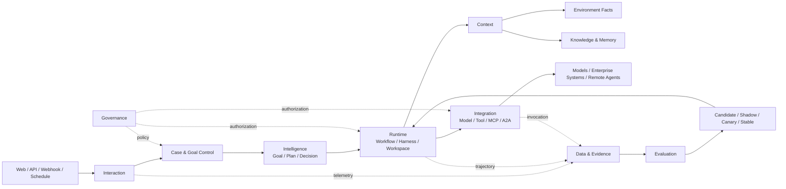

# Architecture overview

> Enterprise Governed Self-Evolving Agent Operating System
>
> 企业级受治理自进化智能体操作系统

Autonoesis separates control, execution, and evidence so no component can simultaneously propose an action, execute its side effect, and declare the real-world outcome successful.

## Logical planes



The eight logical planes are architectural responsibilities, not eight services. Initial physical deployment is intentionally smaller:

| Process | Responsibility |
|---|---|
| `autonoesis-api` | Interaction, domain control plane, governance APIs, context queries |
| `autonoesis-worker` | Durable workflows, task execution, harnesses, evaluation workers |
| `autonoesis-cockpit` | Operator, approval, evidence, evaluation, and release UI |
| `autonoesis-gateway` | Reserved boundary; separated only for security, scale, or reuse |

## Three flows

1. **Control flow**: Request → Case/Goal → Plan → Decision → Run Command → State Transition.
2. **Execution flow**: Task → Harness → Model/Skill → Tool Proposal → Authorization → Action → Tool Result.
3. **Evidence flow**: Snapshot/Decision/Invocation/Artifact/Environment State → Outcome Evidence → Evaluation → Release Evidence.

## Authority

- PostgreSQL is the authoritative store for accepted domain state.
- Temporal owns durable workflow history and continuation, not business truth.
- Object storage owns immutable artifacts and evidence payloads; PostgreSQL owns their metadata and references.
- Event transport is delivery infrastructure, not an authority.
- Models, vector stores, traces, and memory providers are derived or advisory systems.

## Evolution loop

```text
Run → Trajectory → Outcome Evidence → Evaluation → Reflection
    → Candidate → Verification → Approval → Shadow/Canary
    → Stable Release or Rollback
```

Identity, tenant isolation, audit retention, and authorization policy are never self-released. They require explicit human-controlled governance changes.
