# Autonoesis 企业级生产就绪整改路线计划

> 状态：实施基线  
> 适用版本：0.1.x 及后续整改版本  
> 最后评审：2026-08-11  
> 目标：把现有架构原型推进为可审计、可恢复、不可绕过治理边界的企业级受控自进化智能体平台

## 1. 文档目的

本文档把架构评审发现转化为后续实施计划，统一整改优先级、依赖顺序、交付物、验收场景和退出门槛。

本文档不是新的功能愿望清单，也不以“类、表、接口或测试文件已经存在”作为完成依据。整改工作的唯一判断标准是：

1. 关键控制在真实运行路径中不可绕过；
2. 权威状态在故障、并发、重试和多副本环境下保持一致；
3. 每项能力都有可重复的自动化验收证据；
4. 文档声明与实际运行能力一致；
5. 外部副作用和自进化发布均可暂停、接管、对账和回滚。

本文档与现有文档的关系：

- [mvp.md](mvp.md) 记录早期功能建设阶段；其“完成”状态应在本计划的 P0 中按生产证据重新校准；
- [overview.md](../architecture/overview.md) 描述目标架构；本计划负责把目标架构转化为实施顺序；
- [AGENTS.md](../../AGENTS.md) 中的架构规则和完成定义继续有效；
- 涉及权威边界、进程边界、协议、持久化、安全或发布策略的变更必须新增或更新 ADR。

## 2. 当前基线与目标状态

### 2.1 当前基线

当前工程可视为“架构原型和控制面骨架”：

- 领域语言、ADR、威胁模型和逻辑平面划分较完整；
- Goal、Run、Action、Evidence、Outcome、Candidate 等对象已初步建模；
- API、Temporal Worker、Cockpit、PostgreSQL Schema 和若干适配器已经建立；
- 格式、静态类型和部分单元测试具备基础质量；
- P0 参考纵向闭环已通过受控外部系统模拟器和真实 PostgreSQL、Temporal、OPA、MinIO；
  P1 企业治理、P2 生产运维和自进化真实发布仍未端到端成立。

在 P0 退出以前，不得把当前版本描述为以下任一状态：

- 生产级耐久执行平台；
- 完整多租户隔离平台；
- 已完成 MinIO/OPA/OTel 生产集成；
- 已完成 Shadow/Canary 自动发布；
- 可执行高风险真实外部写操作；
- 符合企业合规审计要求。

### 2.2 目标状态

整改后的最小可信平台必须完成以下闭环：

```mermaid
flowchart LR
    I["Intent"] --> G["GoalContract"]
    G --> R["Durable Run"]
    R --> C["ContextSnapshot"]
    C --> P["Validated Plan"]
    P --> T["Task"]
    T --> A["Action Proposal"]
    A --> GW["Governed Tool Gateway"]
    GW --> E["Evidence"]
    E --> O["Outcome Verification"]
    O --> V["Evaluation"]
    V --> IP["ImprovementProposal"]
    IP --> CV["CandidateVersion"]
    CV --> S["Shadow"]
    S --> CA["Canary"]
    CA --> ST["Stable or Rollback"]
```



闭环中的每个箭头都必须有明确的：

- Application Use Case；
- 身份、租户和授权上下文；
- 事务与幂等边界；
- 状态机和并发控制；
- 事件、审计和追踪信息；
- 正向、拒绝、超时、恢复和重复执行测试。

## 3. 整改原则

### 3.1 纵向闭环优先

在一条真实 Goal 执行链路完成前，不新增新的逻辑平面、行业场景、模型提供商或演示页面。优先做穿一条端到端纵向切片，再扩展横向能力。

### 3.2 PostgreSQL 负责已接受业务事实

除 Workflow History 外，所有已接受的业务状态必须持久化到 PostgreSQL。进程内 Store 只能用于单元测试和显式的离线开发模式，不得参与生产装配。

### 3.3 Temporal 只推进流程，不私自创造业务事实

Temporal Workflow 负责 Timer、Signal、Retry、恢复和流程推进。所有业务状态变化必须调用 Application Use Case，并由 PostgreSQL 事务提交。

### 3.4 外部副作用只有一个出口

所有外部写操作必须经过统一 Tool Gateway。模型、Skill、Capability Pack、Activity 和管理员脚本均不得绕过该边界。

### 3.5 评估、生成、审批、发布保持职责分离

身份必须来自受信任运行上下文，不能由请求 Body 自报。Candidate 生成者不能充当 Grader、Approver 或 Release Executor。

### 3.6 以运行证据定义“完成”

能力成熟度统一使用以下状态：

| 状态 | 含义 |
|---|---|
| `specified` | 仅有设计或文档 |
| `modeled` | 有领域模型、接口或状态机 |
| `unit-tested` | 纯逻辑单元测试通过 |
| `integrated` | 真实基础设施组件测试通过 |
| `production-proven` | 故障、并发、安全和运维验收通过 |

README、Roadmap 和 Cockpit 只能展示实际达到的状态。

## 4. 总体阶段与依赖

| 阶段 | 目标 | 依赖 | 退出结果 |
|---|---|---|---|
| P0 | 建立可信受控执行内核 | 无 | 单租户受控纵向闭环，真实基础设施集成通过 |
| P1 | 建立企业治理与受控进化 | P0 | 多租户、身份、证据、评估、Shadow/Canary 闭环 |
| P2 | 建立生产运维与规模化能力 | P1 | HA/DR、安全供应链、容量和运营验收通过 |

阶段采用“门禁驱动”而不是按日期自动结束。上一个阶段的退出门槛未满足时，不得把下一个阶段标记为完成。

## 5. P0：可信受控执行内核

P0 是最高优先级。目标是证明一条真实外部副作用可以在身份、策略、审批、预算、幂等、证据和故障恢复约束下安全完成。

### P0-01 校准能力声明与工程基线

#### 目标

消除文档、控制台和代码之间的成熟度错配，为后续整改建立可信基线。

#### 实施任务

- [x] 将 README 和 `docs/roadmap/mvp.md` 中 Phase 1–3 的状态改为实际成熟度；
- [x] 为主要能力建立 `specified/modeled/unit-tested/integrated/production-proven` 清单；
- [x] 在 Cockpit 静态数据页面增加明确的 Prototype/Demo 标识；
- [x] 删除或修正文档中与代码相冲突的 Phase 描述；
- [x] 建立“能力声明必须引用验收证据”的文档规则；
- [x] 记录当前依赖、数据库 Schema、API Contract 和 Workflow 类型的版本基线。

#### 交付物

- 能力成熟度矩阵；
- 修订后的 README 和 Roadmap；
- 当前版本生产限制说明；
- 一份可重复执行的基线检查报告。

#### 验收

- [x] 文档中不再把占位实现描述为生产完成；
- [x] 每项 `integrated` 或 `production-proven` 能力都有 CI 任务或演练报告引用（PostgreSQL 权威存储由 CI 真实组件任务支持）；
- [x] Cockpit 不再展示无法从真实 API 获取的指标而不标注为示例。

### P0-02 收敛领域模型与不变量

#### 目标

让领域层能表达真实执行约束，避免关键安全语义散落在 Controller、Workflow 或 Adapter 中。

#### 实施任务

- [x] 将 `risk_tier`、预算单位、数据分类和执行模式从裸字符串升级为受约束值对象；
- [x] 为 Goal 增加 Deadline 有效性、Owner/Delegation、数据策略和并发 Run 约束；
- [x] 为 Plan 增加 DAG 环检测、前置条件、预计成本、风险、补偿能力和 Evidence 要求；
- [x] 为 Run 固定 Plan、ContextSnapshot、Agent、Skill、Tool、Model Route 和 Policy Version；
- [x] 将 Action 参数升级为支持嵌套 JSON 的受约束结构；
- [x] 定义完整 `ActionExecutionEnvelope` 和规范化摘要；
- [x] Approval 绑定 Tenant、Run、Action、Tool Version、Operation、Resource Scope、参数摘要、Policy Version 和过期时间；
- [x] Evidence 增加内容摘要、来源身份、采集方法、数据分类、有效时间和完整性状态；
- [x] Outcome 明确关联 Success Criterion ID、验证器版本和 Evidence 集；
- [x] 补齐状态跳转时间、原因、Actor 和乐观锁版本；
- [x] 将 Candidate 生命周期与 Deployment 生命周期显式关联，避免直接 Approved → Stable。

#### 交付物

- 更新后的领域模型；
- 更新后的 Domain Model 文档和 ADR；
- 状态迁移表与非法迁移测试；
- 完整 Action/Approval/Evidence/Outcome 契约。

#### 验收

- [x] Plan 循环依赖、过期 Goal、非法预算和不完整 Approval 在领域层被拒绝；
- [x] 修改 Tool、Operation、Resource 或参数都会改变 Action 摘要；
- [x] Verified Outcome 无完整 Evidence 时无法构造或持久化；
- [x] Candidate 未完成部署门禁时无法成为 Stable。

### P0-03 建立完整 PostgreSQL 权威存储

#### 目标

消除 Hybrid Store 和进程内生产状态，使所有已接受业务事实可持久化、并发安全和可恢复。

#### 实施任务

- [x] 为 Goal、Run、Plan、Task、Action、Approval、Evidence、Outcome、Budget、Audit、Candidate、Trial、Deployment 和 Release 建立 Repository；
- [x] Repository 接口按聚合和 Use Case 组织，避免暴露通用 CRUD；
- [x] 所有写操作支持乐观锁或数据库原子条件更新；
- [x] 添加租户内版本唯一约束、幂等唯一约束、稳定版本唯一约束和合法状态 Check Constraint；
- [x] 使用租户复合外键，禁止跨租户引用；
- [x] `tenant_id` 关联 Tenant Authority，不允许任意孤立 Tenant ID；
- [x] 将 Audit 和 Outbox 与业务状态在同一事务提交；
- [x] 将 Alembic Migration 改为冻结的显式操作，不在历史 Revision 中动态 `metadata.create_all()`；
- [x] 建立 Migration Owner、Application Role、Relay Role 和只读审计角色；
- [x] 移除生产装配中的 InMemoryPlatformStore；
- [x] 为 Store 和 Engine 建立进程级生命周期与优雅关闭。

#### 交付物

- PostgreSQL Repository 实现；
- 新的 Alembic Revision；
- 数据库角色和授权脚本；
- 从旧 Schema 到新 Schema 的迁移与回滚说明；
- 真实 PostgreSQL 组件测试。

#### 验收

- [x] 两个独立 Store/Engine 重建后读取到完整运行和治理状态；
- [x] 两个独立 Store 读取到一致的 Capability、Approval、Kill Switch 和 Release；
- [x] 并发状态更新只有一个成功，其余返回明确冲突；
- [x] 数据库层拒绝跨租户外键和重复 Active Stable Pointer；
- [x] 业务写入失败时业务状态、Audit 和 Outbox 同时回滚。

### P0-04 实现 Application 纵向用例

#### 目标

由 Application 层统一拥有事务、授权不变量和状态推进，API、Workflow 和 Adapter 只负责协议与装配。

#### 首批必需用例

- [x] `CreateGoal`；
- [x] `ActivateGoal`；
- [x] `RequestRun`；
- [x] `PrepareRunContext`；
- [x] `CreateValidatedPlan`；
- [x] `StartTask`；
- [x] `ProposeAction`；
- [x] `RequestApproval`；
- [x] `DecideApproval`；
- [x] `AuthorizeActionAtExecutionTime`；
- [x] `RecordActionAttempt`；
- [x] `RecordEvidence`；
- [x] `ReconcileUnknownAction`；
- [x] `VerifyOutcome`；
- [x] `CompleteRun`；
- [x] `SatisfyOrFailGoal`。

#### 实施规则

- [x] 每个命令携带 Identity、Tenant、Correlation、Causation 和 Idempotency Context；
- [x] 每个写用例明确事务边界；
- [x] 状态变化与 Outbox Event 同事务提交；
- [x] Controller 不直接访问 Store 字典或 ORM Table；
- [x] Activity 不直接决定业务成功；
- [x] Tool Receipt 不能直接转换为 Outcome；
- [x] 拒绝、Unknown、取消和人工接管均为一等用例。

#### 验收

- [x] API、Temporal Activity 和管理命令调用相同 Use Case；
- [x] Goal 执行状态不存在绕过 Application 直接修改权威状态的生产路径；
- [x] 一条参考 Goal 能生成 Context、Plan、Task、Action、Evidence 和 Outcome；
- [x] Run 只有在所有必需 Outcome 被验证后才能成功。

### P0-05 重建 Governed Tool Gateway

#### 目标

使 Tool Gateway 成为真实、不可绕过的外部副作用安全边界。

#### 固定执行流水线

```text
Resolve Identity
→ Verify Tenant and Delegation
→ Resolve Immutable Tool Version
→ Validate Operation and Resource Scope
→ Validate Schema and Semantics
→ Reclassify Risk Server-Side
→ Policy Decision
→ Check Kill Switch
→ Check Quota and Budget
→ Verify Exact Approval and Expiry
→ Broker Short-Lived Credential
→ Atomically Reserve Idempotency Key
→ Execute in Egress/Sandbox Boundary
→ Normalize Result
→ Verify External Effect
→ Record Evidence, Cost, Audit and Event
```

#### 实施任务

- [x] 定义完整 Tool Invocation/Result Contract；
- [x] 使用规范化 JSON 计算完整 Action 摘要；
- [x] 校验 AuthorizationContext 与 Action Tenant 一致；
- [x] 实现 Delegation Port 和资源范围校验；
- [x] 根据 Tool Definition 服务端重新确定风险，不信任模型声明；
- [x] 实现 Approval 的角色、身份、摘要、策略版本和过期复核；
- [x] 使用数据库原子 Reservation 实现幂等；
- [x] 幂等记录包含 Tenant、Tool Version、Key 和 Request Digest；
- [x] 重复 Key 且摘要不同返回冲突，不返回旧结果；
- [x] 预算预留与幂等 Reservation 协调，重复调用不重复计费；
- [x] 失败、拒绝、已接受、成功和未知采用统一结果语义；
- [x] Unknown 禁止盲目重试，必须进入 Reconciliation；
- [x] 所有执行和验证结果写入 Evidence/Audit；
- [x] 增加 Credential Broker 和受控 Egress Port；
- [x] L4 操作默认禁止自动执行。

#### 验收场景

- [x] Approval 后修改任意执行字段都会被拒绝；
- [x] Approval 到期、策略更新或委托撤销后无法执行；
- [x] 相同 Key 并发调用只产生一次外部副作用；
- [x] 相同 Key、不同摘要返回冲突；
- [x] 执行超时进入 Unknown，不自动重复写；
- [x] 外部系统返回 Accepted 时不能直接生成 Verified Outcome；
- [x] Kill Switch 在新 Action 执行前生效并写入审计。

### P0-06 重建 Temporal 耐久编排

#### 目标

证明 Run 能跨进程崩溃、重启、审批等待、取消和外部结果未知继续推进，且不会重复已完成副作用。

#### 实施任务

- [x] 使用受沙箱保护的 Workflow Runner；
- [x] Workflow 只保存确定性流程状态和不可变 ID；
- [x] Activity 通过注入的进程级依赖调用 Application Use Case；
- [x] 移除每个 Activity 创建 Store/Engine 的行为；
- [x] 使用类型化 Workflow/Activity Contract；
- [x] 建立 Run Request Outbox 和 Workflow Dispatcher；
- [x] 使用固定 Workflow ID 和冲突策略保证启动幂等；
- [x] 建立 DB Run 与 Temporal Workflow 的 Reconciler；
- [x] Approval Signal 携带 Approval ID，不携带未经验证的布尔结论；
- [x] Workflow 收到 Signal 后重新读取 PostgreSQL 权威 Approval；
- [x] 支持执行前和执行中的取消、暂停、恢复与人工接管；
- [x] 为 Workflow 增加业务 Deadline、Activity Heartbeat 和合理 Retry Policy；
- [x] 对写 Activity 禁止 Temporal 自动盲重试；
- [x] 为长历史建立 Continue-as-New 策略；
- [x] 为 Workflow 变更使用 Patch/Versioning 并增加历史 Replay 测试。

#### 验收场景

- [x] Run 写入成功但 Workflow 启动失败后，Dispatcher 能恢复启动；
- [x] Worker 在外部写成功后崩溃，恢复时不重复副作用；
- [x] 审批等待跨 Worker 重启保持有效；
- [x] 取消 Signal 在等待、规划和执行阶段均有确定语义；
- [x] Workflow 代码升级后历史执行可 Replay；
- [x] PostgreSQL 与 Temporal 状态不一致时有自动或人工对账路径。

### P0-07 建立 Evidence、Outcome 和 Audit 可信链

#### 目标

让平台能够证明现实世界结果，而不是信任模型或 Tool 的完成声明。

#### 实施任务

- [x] 在存储前完成数据分类、Secret 检测和保留策略判断；
- [x] 实现真实 S3/MinIO ObjectStore Adapter；
- [x] 使用 Tenant 前缀、服务端加密、版本控制和对象锁策略；
- [x] Evidence 元数据与对象写入采用可恢复的 Saga/Outbox 协调；
- [x] Evidence 包含内容摘要、来源、采集器、Action、Subject、时间和分类；
- [x] 实现外部权威 Readback Verifier；
- [x] Outcome Verifier 按 Success Criterion 判断，不依赖 Tool Receipt；
- [x] Audit 使用追加写、摘要链或不可变导出；
- [x] 删除请求生成墓碑、传播任务和删除证明，不静默破坏证据链；
- [x] 修复虚构 `audit://` 引用，只有真实持久化后才能返回 Audit Ref。

#### 验收

- [x] 任意 Verified Outcome 都能追溯到完整 Evidence；
- [x] 修改对象内容会导致摘要校验失败；
- [x] Evidence 缺失、过期或来源不可信时 Outcome 不能验证；
- [x] 删除传播后仍保留合规所需的墓碑和审计关系；
- [x] 审计链可以重建 Actor、Principal、Policy、Approval、Action 和 Outcome。

### P0-08 建立真实基础设施测试基线

#### 目标

将测试重心从独立内存对象推进到真实组件、真实事务和真实故障行为。

#### 测试分层

| 层级 | 作用 | 必需环境 |
|---|---|---|
| Domain Unit | 状态机、不变量、纯算法 | 无外部依赖 |
| Contract | Schema、兼容性、序列化 | 多版本 Contract |
| Component | Repository、Gateway、Adapter | PostgreSQL、OPA、MinIO |
| Workflow | Timer、Signal、Retry、Replay | Temporal Test Server |
| End-to-End | 完整 Goal 执行链 | Compose 测试环境 |
| Failure Injection | 崩溃、超时、重复投递、网络中断 | 可控故障环境 |
| Security | 越权、跨租户、注入、凭证泄漏 | 攻击测试套件 |

#### CI 必需门禁

- [x] Ruff；
- [x] MyPy strict；
- [x] Python Unit/Contract Tests；
- [x] TypeScript Typecheck/Build/Unit Tests；
- [x] PostgreSQL Component Tests；
- [x] Temporal Workflow Tests 和 Replay Tests；
- [x] OPA Policy Tests；
- [x] MinIO Evidence Tests；
- [x] API Consumer Contract Tests；
- [x] Cockpit Playwright Tests；
- [x] 依赖和 Secret 扫描；
- [x] 关键纵向 E2E；
- [x] 测试与演练证据归档。

#### P0 退出门槛

P0 只有在下列条件全部满足时才能结束：

- [x] 参考 Capability Pack 通过真实纵向闭环完成一个 Verified Goal；
- [x] Run 成功前真实产生 Plan、Task、Action、Evidence 和 Outcome；
- [x] 所有权威状态可跨 API/Worker 重启恢复；
- [x] 外部写并发和崩溃测试证明不会重复副作用；
- [x] Tool Gateway 无已知生产绕过路径；
- [x] PostgreSQL、Temporal、OPA、MinIO 集成测试进入 CI；
- [x] README 和 Cockpit 只声明已经验证的能力；
- [x] 仍未完成的功能有明确的 Prototype/Planned 标识。

## 6. P1：企业治理与受控进化

P1 依赖 P0 的可信执行事实。没有真实 Outcome 和 Evidence，不得推进自进化发布。

### P1-01 多维租户隔离

#### 实施任务

- [x] Capability Pack、Agent、Skill、Tool、Policy、Budget、Evaluation、Memory 和 Release 全部租户化；
- [x] 数据库连接使用非超级用户、非 BYPASSRLS 应用角色；
- [x] 所有租户表启用并测试 RLS；
- [x] Object Store 使用租户前缀或独立 Bucket Policy；
- [x] Cache、Search、Vector 和消息主题使用租户命名空间；
- [x] Workflow Namespace、Task Queue 和 Worker Pool 支持按风险与租户隔离；
- [x] Trace、Log、Metric、Evaluation Dataset 和 Audit Export 执行租户过滤；
- [x] Kill Switch 区分平台级和租户级权限，Tenant Admin 不能控制其他租户；
- [x] 跨租户访问统一返回不可枚举的结果并记录安全审计。

#### 验收

- 使用两个真实 Tenant 对 API、DB、Object Store、Workflow、Telemetry、Memory 和 Release 执行攻击矩阵；
- 任意租户同名 Asset 不互相覆盖；
- 平台超级管理员操作必须使用单独受审计的 Break-glass 路径；
- 本地和测试环境不得以数据库超级用户模拟生产隔离。

验证证据：`tests/security/test_tenant_isolation_matrix.py` 在两个真实 Tenant 上使用
`autonoesis_api`（`NOSUPERUSER NOBYPASSRLS`）、PostgreSQL 17、MinIO 和 Temporal 执行完整攻击矩阵；
Tenant Authority 的初始化使用独立管理连接，不参与任何隔离断言。平台 Kill Switch 仅由独立
`autonoesis_breakglass_login` 操作并写入 `platform_audit_events`。

### P1-02 企业身份、委托与审批

#### 实施任务

- [ ] OIDC Validator 进程级复用 JWKS Cache；
- [ ] 校验 Issuer、Audience、Subject、Tenant、Token Type、时间和必要 Claims；
- [ ] 建立 Actor、Principal、Service Identity、Agent Identity 和 Delegation Domain Model；
- [ ] 实现短期委托、资源范围、用途和撤销；
- [ ] Approval 身份来自认证上下文，不接收 Body 自报身份；
- [ ] 高风险 Action 支持双人复核和职责冲突检查；
- [ ] Candidate Generator、Grader、Approver、Release Executor 使用独立角色；
- [ ] 建立 Break-glass、临时授权和事后复核流程。

#### 验收

- 撤销委托后，尚未执行的 Action 立即失去权限；
- 生成者无法通过修改请求字段伪造独立 Grader；
- 双人审批不能由同一 Principal 的两个 Session 代替；
- Break-glass 全程留痕并触发告警。

### P1-03 Context、Environment 和 Memory 可信化

#### 实施任务

- [ ] Environment Fact 增加 Tenant、Subject、Source Authority、Classification 和 Freshness Policy；
- [ ] Context ACL 执行租户、角色、用途、分类和行列权限判断；
- [ ] Snapshot 摘要覆盖内容、版本、策略、信任、新鲜度和 Tool Version；
- [ ] 建立 Conflict Detector 和冲突显式信号；
- [ ] Context Compressor 保留来源、引用和安全指令边界；
- [ ] Memory 只通过独立 Write Gate 写入；
- [ ] Memory Gate 增加 PII、来源、冲突、置信度、TTL 和审批；
- [ ] Memory Ledger 持久化并支持删除传播；
- [ ] Vector Index 只作为可重建投影，不作为权威状态。

#### 验收

- 未授权或跨租户 Context 项无法进入 Snapshot；
- 同一 Snapshot 在内容不变时可复现，内容变化时摘要变化；
- Prompt Injection 内容被标记为不可信数据，不获得执行权限；
- Run Observation 不能绕过 Write Gate 直接进入 Stable Memory。

### P1-04 真实 Evaluation 与 Candidate 门禁

#### 实施任务

- [ ] Evaluation Harness 真正执行固定 Subject Version；
- [ ] Trial 保存输入、环境、模型、工具、随机种子、输出、成本和失败原因；
- [ ] Grader Result 使用 `pass/fail/unknown/invalid` 四态语义；
- [ ] 建立确定性规则、Outcome、Trajectory、LLM 和 Human Grader 流水线；
- [ ] 隐藏用例和生产回放数据与 Candidate Generator 隔离；
- [ ] 重复 Trial 使用统计方法，不以固定次数替代置信度；
- [ ] Candidate 必须引用固定 Baseline、Artifact Digest、Suite Version 和 Generator Identity；
- [ ] Evaluation、Approval 和 Release 结果持久化并产生 Evidence；
- [ ] Forbidden Improvement Target 在 Application 和 Policy 层双重禁止。

#### 验收

- Harness 不执行 Subject 时 Trial 必须 Invalid，而不是 Passed；
- 基础设施错误不得计入绿色通过率；
- Generator 无法访问隐藏测试输出或修改 Grader 配置；
- Candidate 无完整评估证据无法进入 Awaiting Approval。

### P1-05 Shadow、Canary、Stable 与 Rollback

#### 实施任务

- [ ] 建立持久化 Deployment Aggregate；
- [ ] Shadow 同时运行 Stable 与 Candidate，并确保 Candidate 结果不产生外部副作用；
- [ ] 保存 Stable/Candidate 的 Outcome、成本、延迟、安全和人工修正对比；
- [ ] Canary 使用稳定、可审计的流量分配规则；
- [ ] Guardrail Counter 按 Tenant、Deployment、Stage、Metric 隔离；
- [ ] Observation Window 使用真实时间和最小样本门槛；
- [ ] 指标缺失默认阻止晋升，不得静默视为通过；
- [ ] Stable Pointer 更新采用数据库原子 Compare-and-Swap；
- [ ] Rollback 恢复上一 Stable，并保留 Candidate、Release 和回滚证据；
- [ ] 发布和回滚均通过独立 Release Executor 执行。

#### 验收

- Shadow Candidate 不能调用写 Tool；
- Canary 不满足样本量或观察时间不能晋升；
- Guardrail 越界自动回滚且只影响目标 Deployment；
- 两个并发晋升请求只能有一个更新 Stable Pointer；
- 回滚后新 Run 使用上一 Stable，历史 Run 保持原版本引用。

### P1-06 Capability Pack 供应链与运行隔离

#### 实施任务

- [ ] Capability Pack 使用签名 Artifact、固定 Digest 和 SBOM；
- [ ] 安装前验证来源允许列表、签名、依赖、漏洞和兼容性；
- [ ] 禁止未经隔离的第三方 Entry Point 在 API 控制面直接执行；
- [ ] 将复杂 Pack 行为放入受限 Worker/Sandbox；
- [ ] Pack 注册只允许声明 Capability，不允许直接写权威状态；
- [ ] Pack 版本、启用状态和 Stable Channel 按租户管理；
- [ ] Pack 升级、降级、撤销和依赖冲突均有事务与审计。

#### 验收

- 修改 Pack 内容但保留版本号或签名时安装失败；
- Pack 代码无法读取其他租户凭证和数据；
- Pack 无法绕过 Tool Gateway 产生外部副作用；
- 撤销 Pack 后新 Run 无法使用，被影响的存量 Run 有明确处置策略。

### P1-07 可观测性、AI FinOps 和运营 Cockpit

#### 实施任务

- [ ] API、Worker、Gateway、Repository 和外部 Adapter 接入 OpenTelemetry；
- [ ] Trace 贯穿 Goal、Run、Task、Action、Approval、Evidence 和 Outcome；
- [ ] Log 结构化并执行 Secret/PII 脱敏；
- [ ] Metric 基于真实事件计算，不使用静态或进程内示例数据；
- [ ] SLO 按 Sample Count 加权并区分 `gte/lte` 目标；
- [ ] AI FinOps 使用真实账本，区分预估、预留、结算和重试浪费；
- [ ] Cockpit 通过 API 展示真实状态、版本和审计引用；
- [ ] 实现 Approval、Unknown Reconciliation、Kill Switch、Rollback 和人工接管操作页；
- [ ] 所有高风险运营动作要求权限、幂等和二次确认。

#### P1 退出门槛

- [ ] 多租户全链路隔离攻击测试通过；
- [ ] 企业 OIDC、委托、审批和 Break-glass 流程通过；
- [ ] Context 与 Memory 不能绕过 ACL/Write Gate；
- [ ] Candidate 经过真实 Evaluation、Shadow、Canary 后才能 Stable；
- [ ] Guardrail 越界自动回滚演练通过；
- [ ] Cockpit 显示和操作真实平台状态；
- [ ] 每个 Stable Release 都有完整证据链。

## 7. P2：生产运维与规模化

### P2-01 生产部署和安全域

- [ ] 建立 Kubernetes Helm Chart；
- [ ] API、Worker、Gateway、Evaluator 和 Release Executor 独立 Service Account；
- [ ] Gateway 部署在受控出口网络，默认拒绝未知 Egress；
- [ ] 使用 Secret Manager/Vault 和短期凭证；
- [ ] 配置 Pod Security、NetworkPolicy、ResourceQuota 和只读文件系统；
- [ ] 按风险层级建立独立 Worker Pool 和 Sandbox；
- [ ] 建立多可用区、滚动升级和容量保护策略。

### P2-02 HA、备份与灾难恢复

- [ ] PostgreSQL 配置 PITR 和定期恢复验证；
- [ ] Temporal 使用生产级持久化和备份策略；
- [ ] Object Store 配置版本、复制、对象锁和生命周期；
- [ ] Stable Pointer、Policy、Capability Artifact 和 Secret 有独立备份；
- [ ] 建立 RTO/RPO 并进行季度完整恢复演练；
- [ ] 验证恢复后未完成 Run 可继续且不重复副作用；
- [ ] 验证 Tenant 级恢复不会污染其他租户。

### P2-03 软件与能力供应链

- [ ] 生成 Python/Node/Image/Capability Pack SBOM；
- [ ] 执行 SAST、SCA、Secret、Container 和 IaC 扫描；
- [ ] 镜像和 Artifact 使用签名与 Provenance Attestation；
- [ ] 依赖升级使用自动 PR、兼容测试和回滚策略；
- [ ] Release 产物不可变并可追溯到 Commit、CI 和测试证据；
- [ ] 禁止开发依赖、测试凭证和原始客户数据进入生产镜像。

### P2-04 容量、性能与混沌验证

- [ ] 定义 Goal、Run、Action 和 Tenant 级容量模型；
- [ ] 对 PostgreSQL RLS、Outbox、Temporal Queue 和 Gateway 进行压测；
- [ ] 测量审批积压、Unknown 激增和 Provider 故障时的退化行为；
- [ ] 注入 Worker Crash、DB Failover、网络分区、对象存储错误和消息重复；
- [ ] 验证预算、并发限制、速率限制和 Kill Switch 在压力下仍生效；
- [ ] 建立容量基线、扩容阈值和成本模型。

### P2-05 运营与客户交付准备

- [ ] 完成 Provider Failure、Action Unknown、Approval Backlog、Tenant Leakage、Memory Poisoning 和 Rollback Runbook；
- [ ] 为每个 Runbook 建立定期演练记录；
- [ ] 建立值班、告警分级、事件响应和客户通知流程；
- [ ] 建立租户开通、升级、暂停、导出、删除和退出流程；
- [ ] 发布支持版本、升级窗口、弃用策略和安全响应承诺；
- [ ] 建立生产变更审批和紧急回滚机制。

#### P2 退出门槛

- [ ] 生产基础设施、HA、备份和恢复演练通过；
- [ ] 供应链签名、SBOM 和安全扫描进入发布门禁；
- [ ] 关键 SLO 有真实指标、告警和 Error Budget Policy；
- [ ] 容量和混沌测试达到既定门槛；
- [ ] 运行手册已由非开发人员成功执行；
- [ ] 平台具备受限企业试点和逐步扩大流量的条件。

## 8. 跨阶段工程治理

### 8.1 工作项模板

每个整改工作项至少包含：

```yaml
id: P0-XX
problem: 当前风险或缺口
scope: 明确包含和不包含的范围
authority_boundary: 涉及的权威和安全边界
design: ADR 或设计说明
implementation: 代码、Schema、配置和迁移
tests: 正向、拒绝、并发、恢复和攻击场景
observability: Log、Metric、Trace、Audit
rollout: 部署、兼容、迁移和回滚
evidence: CI、测试报告或演练记录
owner: 单一责任人
reviewers: Domain、Security、SRE 或相关角色
```

### 8.2 Definition of Ready

工作进入开发前必须满足：

- 问题、风险和目标行为清楚；
- 权威边界、租户边界和身份来源明确；
- Contract 与状态迁移已定义；
- 数据迁移和向后兼容影响已评估；
- 正向、负向、并发和恢复测试已列出；
- 需要 ADR 的变更已经起草；
- 不依赖未定义的“后续组件”才能形成安全闭环。

### 8.3 Definition of Done

工作完成必须满足：

- Domain/Application/Adapter 依赖方向正确；
- 格式、Lint、Type、Unit、Contract、Component 和 Security 检查通过；
- 真实基础设施路径已验证，不只通过 Fake/InMemory Test；
- 权限拒绝、超时、重复、崩溃和恢复场景通过；
- Audit、Metric、Trace 和 Runbook 已更新；
- 数据迁移、兼容和回滚路径已验证；
- README/Roadmap/Cockpit 的能力状态同步更新；
- 验收证据保存到 CI Artifact 或演练记录；
- 不存在已知绕过统一 Tool Gateway 或 Application Use Case 的路径。

### 8.4 ADR 触发条件

以下变更必须新增或更新 ADR：

- 进程或部署边界；
- PostgreSQL、Temporal、Object Store 或 Event Bus 权威职责；
- Tool/Model Gateway 协议和安全流水线；
- 身份、委托、租户和审批语义；
- Workflow 类型、版本和恢复策略；
- Evidence、Audit、保留或删除策略；
- Candidate、Evaluation、Shadow、Canary 和 Release Policy；
- Capability Pack 执行和供应链模型。

## 9. 必须持续执行的验收场景

以下场景应成为长期回归套件，而不是一次性人工测试：

| ID | 场景 | 期望结果 |
|---|---|---|
| AC-01 | 同一写 Action 并发执行 100 次 | 外部副作用仅发生一次 |
| AC-02 | 外部写成功后 Worker 立即崩溃 | 恢复后不重复执行，Run 继续推进 |
| AC-03 | Approval 后修改 Resource 或参数 | Tool Gateway 拒绝执行 |
| AC-04 | Approval 过期或 Policy 更新 | 执行时重新授权失败 |
| AC-05 | 外部调用超时且结果不明 | Action 进入 Unknown，禁止盲重试 |
| AC-06 | 权威回读确认副作用成功 | 生成 Evidence，Action 转 Succeeded |
| AC-07 | Tool Receipt 声称成功但无 Evidence | Outcome 不得 Verified |
| AC-08 | Tenant A 请求 Tenant B 的对象 | 所有层隐藏对象并记录安全审计 |
| AC-09 | Candidate Generator 自报其他 Grader ID | 服务端身份检查拒绝职责冲突 |
| AC-10 | Shadow Candidate 提议写操作 | 副作用被隔离或拒绝 |
| AC-11 | Canary Guardrail 连续越界 | 自动回滚至上一 Stable |
| AC-12 | PostgreSQL/Temporal/Object Store 恢复 | 未完成 Run 可继续，证据完整 |
| AC-13 | Kill Switch 在高并发下激活 | 新 Action 全部被阻止，已有 Action 有明确语义 |
| AC-14 | Capability Pack 内容被篡改 | 签名或摘要校验失败，禁止安装 |
| AC-15 | Context 含间接 Prompt Injection | 内容保持不可信，不获得额外权限 |

## 10. 进度衡量

不得使用代码行数、类数量、表数量或测试总数作为主要进度指标。建议持续跟踪：

- 权威对象中已有完整 PostgreSQL Repository 的比例；
- 写 Use Case 中与 Outbox 同事务提交的比例；
- 外部副作用中经过统一 Tool Gateway 的比例；
- Verified Outcome 中具备完整 Evidence Chain 的比例；
- 真实组件测试占全部关键路径测试的比例；
- Workflow Replay 通过率；
- Action Unknown Rate 和平均对账时间；
- 重复副作用率；
- 跨租户拒绝测试通过率；
- Candidate 从 Draft 到 Stable 的完整证据覆盖率；
- Canary 自动回滚演练成功率；
- 单位 Verified Goal 的真实总成本；
- Runbook 演练成功率和恢复时间。

## 11. 风险与控制

| 风险 | 影响 | 控制措施 |
|---|---|---|
| 继续横向增加模块 | 主链长期无法完成 | P0 前冻结非必要新能力 |
| 文档再次超前 | 企业评审失真 | 成熟度标签和证据引用门禁 |
| 生产继续使用 InMemory Store | 状态丢失和多副本不一致 | 装配时显式禁止并启动失败 |
| RLS 使用超级用户测试 | 隔离测试失真 | 使用真实最小权限应用角色 |
| Tool Gateway 被内部代码绕过 | 未授权副作用 | 架构测试、网络隔离和凭证只在 Gateway |
| Workflow 与 DB 双写不一致 | Run 卡死或重复启动 | Outbox Dispatcher 和 Reconciler |
| Candidate 自评或伪造身份 | 不安全版本发布 | 服务端身份、角色和职责冲突检查 |
| Shadow 产生真实写操作 | 未验证版本影响生产 | 只读凭证、Effect Sink 和网络隔离 |
| 测试只覆盖 Fake | 错误生产信心 | 真实组件和故障注入进入 CI |
| Capability Pack 任意代码执行 | 供应链入侵 | 签名、Sandbox、Allowlist 和最小权限 |

## 12. 建议的首批实施顺序

后续迭代应严格按以下顺序启动：

1. P0-01：校准 README、Roadmap 和 Cockpit 声明；
2. P0-02：冻结 Action/Approval/Evidence/Outcome Contract；
3. P0-03：建立 PostgreSQL 角色、约束和核心 Repository；
4. P0-04：实现 Goal → Run → Plan → Task Application Use Case；
5. P0-05：实现原子幂等和执行时授权 Tool Gateway；
6. P0-07：实现真实 Evidence Store 和 Outcome Verifier；
7. P0-06：将上述 Use Case 接入 Temporal Workflow；
8. P0-08：用真实 PostgreSQL、Temporal、OPA、MinIO 建立 E2E；
9. 执行 Worker Crash、重复写、Approval 过期和 Unknown 对账演练；
10. 只有 P0 退出门槛全部满足后，启动 P1 多租户与受控进化。

在这一顺序中，API 和 Cockpit 只暴露已经由 Application 和真实 Repository 支持的能力。不得先做新的 UI 页面来代替后端闭环。

## 13. 最终生产准入判定

Autonoesis 只有同时满足以下条件，才可以被描述为“企业级受控自进化智能体平台”：

1. 外部副作用只能经过不可绕过的 Tool Gateway；
2. 所有已接受业务事实在 PostgreSQL 中持久化并具备并发保护；
3. Temporal 故障恢复不会重复已完成副作用；
4. 多租户隔离在真实基础设施上经过攻击测试；
5. Verified Outcome 总能追溯到可信 Evidence；
6. 身份、委托、审批、预算和策略在执行时重新验证；
7. Candidate 必须经过独立 Evaluation、Shadow、Canary 和 Release Gate；
8. Stable 发布可自动或人工回滚，并保留完整证据；
9. 关键 SLO、告警、备份、恢复和 Runbook 已经过演练；
10. 所有能力声明都能引用可重复的自动化或演练证据。

在这些门槛满足以前，项目应继续使用“架构原型”“工程预览”或“受控执行内核建设中”等准确表述。
